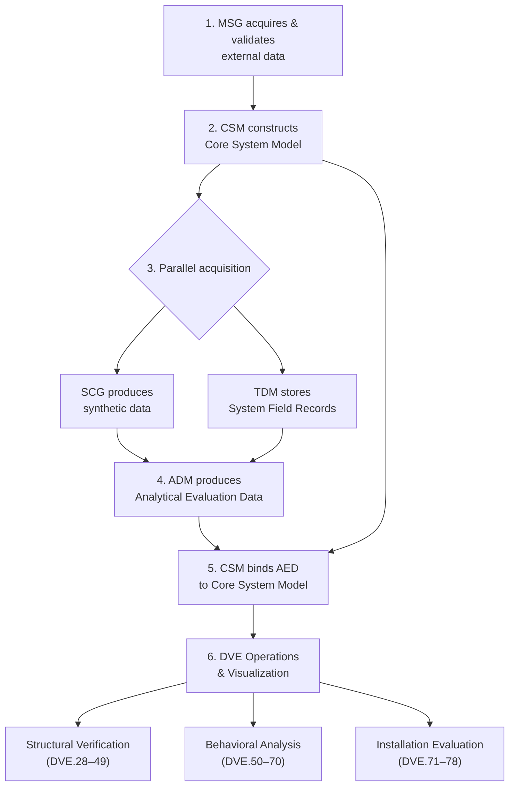
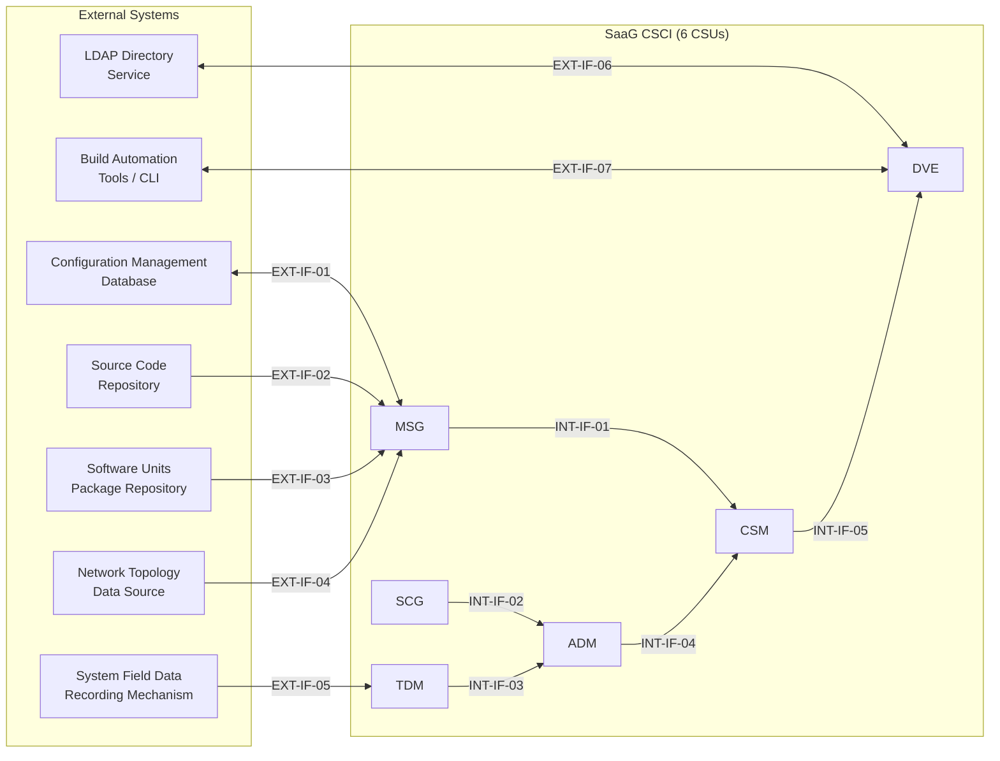

# Software Design Description (SDD): System as a Graph (SaaG)

**Definition:** The System as a Graph (SaaG) Digital System Model is a static digital system model developed using an architectural digital twin approach, which models the structural and relational architecture of the system using a node-relationship representation, without actually running the system applications. In this model, system entities such as software units, middleware and communication services, processor/console units, topics, and messages are represented as nodes; the dependency, publishing, and consuming relationships between them are represented as relationships. The behavioral analysis dimension of the model is achieved not by running the components, but by overlaying Analytical Evaluation Data — derived from field records or the scenario generator — onto this model.

**Purpose:** This SDD describes the design that satisfies the SRS, specifying the CSCI-wide design decisions (§1), the CSCI's architectural decomposition, concept of execution, interface design, and database design (§2), the detailed design of each CSC down to CSU level (§3), and the traceability of every SRS requirement to the design element that satisfies it (§4). It reflects the clean one-to-one (1:1) mapping between CSCs and CSUs (6 CSCs ↔ 6 CSUs) defined in the SRS and SDP — each CSU is decomposed internally into modular design elements.

---

## 1. CSCI-Wide Design Decisions

1. **Static digital twin, no execution**: The CSCI never executes the target system's actual software units; it constructs and analyzes a node-relationship representation of the system's architecture (SRS §1.1 MSG.1, §5.1 CSM.1).
2. **Separable structural and behavioral layers**: The structural graph (Core System Model, built from Model Setup Data) and the behavioral overlay (Analytical Evaluation Data, built from field records or synthetic data) are constructed independently and bound together by CSM without altering the structural graph, so they remain separable at all times (SRS §5.1 CSM.36).
3. **Concurrency-safe shared model access**: Multiple user sessions, and multiple concurrent production-pipeline/analysis/simulation operations, read and write the same Core System Model without compromising model integrity or result consistency (SRS §5.1 CSM.29–30).
4. **Non-destructive experimentation**: Structural "what-if" changes (adding/removing nodes or relationships, altering attributes) are performed only on a working model derived from the Core System Model, never on the Core System Model itself (SRS §6.1 DVE.17).
5. **Common validation-and-error-recording pattern**: Every data-acquisition path in the CSCI (configuration data, source repository files, field records, synthetic data, Model Setup Data) performs format/integrity/mandatory-field checks and records failures with a consistent set of attributes (source, reason, time), rather than each CSC inventing its own error model (SRS §1.1 MSG.16, 20, 22; §3.1 TDM.5; §4.1 ADM.5–6).

---

## 2. CSCI Architectural Design

### 2.1 CSCI Components

The SaaG CSCI is decomposed into 6 Computer Software Components (CSCs) and 6 Computer Software Units (CSUs) in a direct 1-to-1 mapping, identical to the decomposition established in the SRS:

| CSC | Abbreviation | CSU | SRS Reference | SDD Reference |
|---|---|---|---|---|
| Model Setup Generator | SaaG-MSG | MSG | §1.1 | §3.1 |
| Scenario Generator | SaaG-SCG | SCG | §2.1 | §3.2 |
| Telemetry Data Manager | SaaG-TDM | TDM | §3.1 | §3.3 |
| Analytical Data Manager | SaaG-ADM | ADM | §4.1 | §3.4 |
| Core System Model | SaaG-CSM | CSM | §5.1 | §3.5 |
| Design Verification Engine | SaaG-DVE | DVE | §6.1 | §3.6 |

### 2.2 Concept of Execution

1. **MSG** acquires and validates data from the configuration management database, source code repository, package repository, and network topology source, and assembles it into a Model Setup Data file.
2. **CSM** ingests the Model Setup Data file and constructs the Core System Model (nodes and relationships).
3. In parallel, **SCG** produces synthetic data from user-defined scenarios, and **TDM** stores System Field Records uploaded from the field.
4. **ADM** consumes either the System Field Records (from TDM) or the synthetic data (from SCG) — never both for the same run — and produces Analytical Evaluation Data.
5. **CSM** binds the Analytical Evaluation Data to the relevant nodes and relationships of the Core System Model, preserving which upstream source (field or synthetic) produced it.
6. **DVE** is the sole component through which users and automation clients (CLI/build tools) interact with the model: driving production processes, performing read-only rule-based structural verification, behavioral simulation/drift analysis, and installation suitability evaluation.

This sequencing matches the incremental build order already established in SDP §2.

**Figure 1. CSCI Concept of Execution**

```mermaid
flowchart TD
    A["1. MSG acquires &amp; validates<br/>external data"] --> B["2. CSM constructs<br/>Core System Model"]
    B --> C{"3. Parallel acquisition"}
    C --> D["SCG produces<br/>synthetic data"]
    C --> E["TDM stores<br/>System Field Records"]
    D --> F["4. ADM produces<br/>Analytical Evaluation Data"]
    E --> F
    F --> G["5. CSM binds AED<br/>to Core System Model"]
    B --> G
    G --> H["6. DVE Operations<br/>&amp; Visualization"]
    H --> I["Structural Verification<br/>(DVE.28–49)"]
    H --> J["Behavioral Analysis<br/>(DVE.50–70)"]
    H --> K["Installation Evaluation<br/>(DVE.71–78)"]
```

### 2.3 Interface Design

SaaG has 12 interfaces: 7 external interfaces connecting the CSCI to systems outside its boundary, and 5 internal interfaces connecting its CSUs to one another.

**Table 1. External Interfaces**

| ID | Interface | Direction | CSU | SRS Reference |
|---|---|---|---|---|
| EXT-IF-01 | Configuration Management Database | Bidirectional (query/response) | MSG | MSG.2, 9–13, 16 |
| EXT-IF-02 | Source Code Repository | Inbound | MSG | MSG.3, 17–20 |
| EXT-IF-03 | Software Units Package Repository | Inbound | MSG | MSG.4 |
| EXT-IF-04 | Network Topology Data Source | Inbound (automatic or manual) | MSG | MSG.5–7 |
| EXT-IF-05 | System Field Data Recording Mechanism | Inbound (upload) | TDM | TDM.2 |
| EXT-IF-06 | LDAP Directory Service | Bidirectional | DVE | DVE.3 |
| EXT-IF-07 | Build Automation Tools / CLI | Bidirectional | DVE | DVE.27 |

**Table 2. Internal Interfaces**

| ID | Interface | Direction | SRS Reference |
|---|---|---|---|
| INT-IF-01 | Model Setup Data Handoff | MSG → CSM | MSG.23 / CSM.2 |
| INT-IF-02 | Synthetic Data Handoff | SCG → ADM | SCG.7 / ADM.3 |
| INT-IF-03 | Field Records Handoff | TDM → ADM | TDM.4 / ADM.2 |
| INT-IF-04 | Analytical Evaluation Data Handoff | ADM → CSM | ADM.4 / CSM.33 |
| INT-IF-05 | Core System Model Access (read-only) | CSM → DVE | CSM.27–28 / DVE.30, DVE.59 |

**Figure 2. External and Internal Interface Topology**

```mermaid
flowchart LR
    subgraph EXT["External Systems"]
        CMDB["Configuration Management<br/>Database"]
        REPO["Source Code<br/>Repository"]
        PKG["Software Units<br/>Package Repository"]
        NTS["Network Topology<br/>Data Source"]
        FDR["System Field Data<br/>Recording Mechanism"]
        LDAP["LDAP Directory<br/>Service"]
        BAT["Build Automation<br/>Tools / CLI"]
    end
    subgraph CSCI["SaaG CSCI (6 CSUs)"]
        MSG["MSG"]
        SCG["SCG"]
        TDM["TDM"]
        ADM["ADM"]
        CSM["CSM"]
        DVE["DVE"]
    end
    CMDB <-->|"EXT-IF-01"| MSG
    REPO -->|"EXT-IF-02"| MSG
    PKG -->|"EXT-IF-03"| MSG
    NTS -->|"EXT-IF-04"| MSG
    FDR -->|"EXT-IF-05"| TDM
    LDAP <-->|"EXT-IF-06"| DVE
    BAT <-->|"EXT-IF-07"| DVE
    MSG -->|"INT-IF-01"| CSM
    SCG -->|"INT-IF-02"| ADM
    TDM -->|"INT-IF-03"| ADM
    ADM -->|"INT-IF-04"| CSM
    CSM -->|"INT-IF-05"| DVE
```

Every data-acquisition interface reports its own deficiency/access/format/integrity errors back through itself, consistent with the CSCI-wide validation pattern (§1, decision 5). The communication method and protocol for every interface listed above, and the choice between automatic and manual acquisition for EXT-IF-04, are to be determined during the critical design phase (tracked in CDR §1.4).

### 2.4 Database Design

SaaG persists 7 data stores:

**Table 3. Data Stores**

| Store | Description | Owning CSU | SRS Reference |
|---|---|---|---|
| Model Setup Data file | Validated source data assembled for model construction | MSG | MSG.23 |
| Software Unit Version Inventory | Software unit name/version per project, platform, version | MSG | MSG.14–15 |
| Field Records Database | Uploaded System Field Records and telemetry | TDM | TDM.1–4 |
| Core System Model | Node-relationship structural graph | CSM | CSM.4–5 |
| Analytical Evaluation Data | Behavioral overlay bound to the Core System Model | CSM | CSM.34 |
| Working Model | Non-destructive structural sandbox derived from the Core System Model | DVE | DVE.17 |
| Findings, Operations & Reports | Verification/analysis/evaluation findings, operation records, and generated reports | DVE | DVE.21–26 |

Database-wide design decisions: (1) every store is keyed by project/platform/system-version; (2) the Core System Model and Analytical Evaluation Data are separable layers managed within CSM, joined via CSM's binding, per §1 decision 2; (3) Analytical Evaluation Data and the Findings/Operations/Reports store both preserve upstream-source provenance (field record vs. synthetic); (4) ingestion-oriented stores (Model Setup Data file, Field Records Database) share the common validation-status attribute set from §1 decision 5. Physical storage technology per store, and the detailed entity schemas and attribute definitions for all 7 stores, are to be determined during the critical design phase (tracked in CDR §1.5).

---

## 3. CSCI Detailed Design

### 3.1 MSG — Model Setup Generator (SaaG-MSG)

#### 3.1.1 CSU-wide design decisions

All external data acquisition funnels through a common validation and error-recording path (mandatory-field checks, missing-data status, access/authorization/integrity error handling) before a single Model Setup Data file is assembled (MSG.1).

#### 3.1.2 Design elements

**Data Source Connector & Configuration Manager** — manages controlled, traceable access to the four external data sources (configuration management database, source code repository, package repository, network topology data source), including user-definable per-source configuration (source type, name, access method, connection address, credentials) and the two supported methods of network topology acquisition (automatic or manual entry). Traces to MSG.2–8.

**Configuration Data Acquisition** — retrieves current project, platform, and system version information from the configuration management database; marks the effective version; marks the acquisition process with an error status on deficiency, access error, or format incompatibility. Traces to MSG.9–13, 16.

**Software Unit Version Inventory Manager** — records and updates the Software Unit Version Inventory (software unit name/version per project, platform, version), including insertion of a candidate software unit version alongside the other defined versions. Traces to MSG.14–15.

**Source Repository Ingestion** — transfers source code, installation scripts, and configuration files for the software units in scope from the source code repository; records file name, path, package/version, and update timestamp per file; reports missing-data status for mandatory files that cannot be obtained; reports access/authorization/integrity errors. Traces to MSG.17–20.

**Data Validation & Model Setup Data Assembler** — performs a mandatory-field-presence check across all received/manually-entered source data; records error reason, source name/type, project/platform association, and error time for each failure; assembles the data that passes verification into the Model Setup Data file handed off via INT-IF-01. Traces to MSG.21–23.

### 3.2 SCG — Scenario Generator (SaaG-SCG)

#### 3.2.1 CSU-wide design decisions

Synthetic data generation is fully decoupled from field data collection; scenario inputs and the data they produced are recorded together so any synthetic data set is traceable back to the exact inputs that generated it (SCG.1, 6).

#### 3.2.2 Design elements

**Scenario Input Manager** — captures and traceably records user-defined scenario inputs: scenario scope, scenario type, time interval, data density, and data types to be produced. Traces to SCG.3, 6.

**Synthetic Data Generator** — serves as the data source for system-wide simulation processes; produces synthetic data structurally equivalent to the topic/message schema, field naming, and value-range constraints used by the actual software units. Traces to SCG.2, 4.

**Scenario Output Recorder** — records produced synthetic data together with scenario name, production time, and project/platform/system-version association; prepares the data for transfer via INT-IF-02. Traces to SCG.5, 7.

### 3.3 TDM — Telemetry Data Manager (SaaG-TDM)

#### 3.3.1 CSU-wide design decisions

System Field Records are stored centrally and indexed for retrieval by project, platform, system version, record source, and upload time; upload-time validation prevents malformed records from entering the store (TDM.1). Storage hardware disk capacity is an environment/infrastructure requirement (SRS TDM-INF.1) whose sizing will be determined during the critical design phase; it is not modeled as a CSU-level design element.

#### 3.3.2 Design elements

**Record Upload Manager** — accepts user uploads of telemetry and system data records in a controlled, traceable manner, associated with project/platform/system-version; detects and reports format incompatibility, integrity errors, or missing fields at upload time. Traces to TDM.2, 5.

**Record Catalog Manager** — records each uploaded System Field Record with its source, upload time, and project/platform/version association; supports listing, search, and selection of existing records by project, platform, system version, record source, or upload time. Traces to TDM.3–4.

### 3.4 ADM — Analytical Data Manager (SaaG-ADM)

#### 3.4.1 CSU-wide design decisions

Analytical Evaluation Data is produced from exactly one of two upstream sources — System Field Records (via TDM, INT-IF-03) or synthetic data (via SCG, INT-IF-02) — through parallel, independently-validated ingestion paths that converge on a single assembly step (ADM.1).

#### 3.4.2 Design elements

**Field Record Ingestion** — obtains System Field Records from TDM for Analytical Evaluation Data production; detects and reports format incompatibility or unreadable data. Traces to ADM.2, 5.

**Scenario Data Ingestion** — obtains synthetic data from SCG for Analytical Evaluation Data production; detects and reports format incompatibility, unreadable data, or missing fields. Traces to ADM.3, 6.

**Analytical Data Assembler** — processes and appropriately associates the ingested System Field Records or synthetic data, and produces the Analytical Evaluation Data transmitted via INT-IF-04. Traces to ADM.4.

### 3.5 CSM — Core System Model (SaaG-CSM)

#### 3.5.1 CSU-wide design decisions

The Core System Model is built once from validated Model Setup Data and then shared read/write across concurrent sessions and pipeline operations without compromising integrity (CSM.1, 29–30). The structural graph and the behavioral overlay (Analytical Evaluation Data) are managed as separable layers (CSM.36), with upstream-source provenance preserved (CSM.35).

#### 3.5.2 Design elements

**Model Construction Engine** — accepts the Model Setup Data produced by MSG via INT-IF-01; performs format/schema/integrity/mandatory-field checks; converts validated data into a node-relationship Core System Model associated with project/platform/system version; reports missing-entity and invalid-relationship errors; records the Model Setup Data file used, creation time, and model status. Traces to CSM.2–5, 25–26.

**Node-Relationship Schema Manager** — defines and maintains the 12 node types (System, Software Segment, CSCI, CSC, CSU, Role, Topic, Message, Operator Console/Processor Units, Network components, Middleware Services, Communication Technology services) and 6 relationship types (runs-on, uses-middleware/communication-service, publishes, consumes, depends-on, assigned-to-role); exposes CPU allocation, OS settings, and runtime environment configuration as queryable node attributes. Traces to CSM.6–24.

**Model Access Provider** — makes the Core System Model, and the Analytical Evaluation Data bound to it, available for read access via INT-IF-05. Traces to CSM.27–28.

**Concurrency & Session Manager** — handles concurrent read/write operations from multiple user sessions on the same Core System Model without compromising integrity or query-result consistency; executes production-pipeline operations and user analysis/simulation operations concurrently and independently of one another. Traces to CSM.29–30.

**Candidate Evaluation Model Builder** — creates a new, process-specific Core System Model combining a candidate software unit version under evaluation with the other software units of the target system version, isolated from other concurrent evaluations. Traces to CSM.31.

**Analytical Data Ingestion** — accepts Analytical Evaluation Data produced by ADM via INT-IF-04. Traces to CSM.33.

**Node/Relationship Matcher & Binder** — associates the Analytical Evaluation Data with the relevant project/platform/system version/model; matches record, telemetry, and synthetic data to the corresponding nodes and relationships; preserves provenance (field vs. synthetic); binds without altering the Core System Model, keeping the two layers separable. Traces to CSM.32, 34–36.

**Unmatched Record Reporter** — reports node or relationship records for which no counterpart can be found in the Analytical Evaluation Data. Traces to CSM.37.

### 3.6 DVE — Design Verification Engine (SaaG-DVE)

#### 3.6.1 CSU-wide design decisions

DVE is the central interaction and computation engine for verification, analysis, and evaluation. It drives MSG/CSM/ADM workflows, presents visual graph analytics, performs read-only structural verification against the Core System Model (DVE.1–2, 28–30), conducts simulation and observational analysis (DVE.50–52), and evaluates candidate software units for CI/CD gating (DVE.71, 77).

#### 3.6.2 Design elements

##### 3.6.2.1 Operations and Visualization Design Elements

**Session & Authentication Manager** — authenticates users against a defined LDAP directory service (EXT-IF-06) and restricts access to their authorizations; lets the user select the working project/platform/system version and see the currently effective version. Traces to DVE.3–4.

**Model Setup Data Workflow Manager** — lists Model Setup Data files for the selected project/platform/version and lets the user pick one; starts and monitors the Model Setup Data production process (in progress/successful/failed) and the Core System Model creation process; continuously displays data-source accessibility status; displays missing-data/access/authorization/format/integrity errors from MSG. Traces to DVE.5–9.

**Analytical Data Workflow Manager** — lets the user choose the Analytical Evaluation Data source (System Field Records or SCG synthetic data), select field records or specify scenario inputs accordingly, start/track synthetic- and Analytical-Evaluation-Data production and view errors, and displays the resulting binding/matching status from CSM. Traces to DVE.10–16.

**Working Model Editor** — derives a working model from the Core System Model and lets the user add/remove nodes and relationships and update attributes without breaking structural integrity, enabling verification/analysis operations on the updated working model instead of the Core System Model directly. Traces to DVE.17.

**Model Visualization & Navigation UI** — lets the user search the node-relationship structure, filter by type/project/platform/system-version/software-unit, and perform zoom/pan/selection/attribute-display operations. Traces to DVE.19–20.

**Findings & Reporting Manager** — classifies verification/analysis results as conforming/non-conforming; presents each finding with identifier, type, description, affected entity/relationship, related rule/acceptance criterion, supporting evidence, and severity; records cause-and-effect relationships between findings from the same operation; supports sort/filter of findings; records error cause/interruption stage/time for interrupted operations; records simulation scenario metadata; generates exportable summary/detailed reports. Traces to DVE.18, 21–26.

**Automation Interface (CLI/Build Tools)** — accepts analysis requests from Build Automation Tools and a Command Line Interface via EXT-IF-07; presents ongoing-operation status to both interactive users and automation clients; ensures requested operations run concurrently and independently of one another. Traces to DVE.27.

##### 3.6.2.2 Structural Verification Design Elements

**Structural & Dependency Analysis Engine** — analyzes structural dependencies, communication connections, and runtime-environment relationships between system entities; detects resource-contention/bottleneck conditions, circular dependencies, and disconnected/missing/invalid/unmatched structural relationships. Traces to DVE.31, 46–48.

**Topic QoS Verification Engine** — verifies topic data transmission quality-of-service conformance for Durability, Reliability, Lifespan, and Transport Priority parameters. Traces to DVE.32–35.

**Publisher/Consumer Matcher** — verifies topic data publisher/consumer matches, detecting topics with no publisher, no consumer, or conflicting same-name content definitions. Traces to DVE.36–38.

**Communication Consistency Verifier** — verifies the mutual consistency of source, destination, message, and communication direction information in external-to-middleware communications. Traces to DVE.39.

**Resource Allocation Verifier** — analyzes software-unit load-balancing distribution across processor/console units; verifies processor core allocation, operating system settings, and runtime environment memory allocation conformance. Traces to DVE.40–45.

**Architectural Rule Verifier** — detects design patterns that violate architectural rules. Traces to DVE.49.

##### 3.6.2.3 Behavioral Simulation and Analysis Design Elements

**Simulation Analysis Engine** — analyzes, using synthetic-sourced Analytical Evaluation Data, message flow/count/volume/frequency; the effect of a node/relationship becoming inactive; design-time traffic analysis under increased topic/message density or changed publish/consume behavior; propagation of fault/load/communication-interruption/bandwidth-narrowing conditions to dependent nodes; and highest-resource-usage/most-intensive-messaging entities. Traces to DVE.53–58.

**Field Data Analysis Engine** — analyzes, using field-record-sourced Analytical Evaluation Data, operational/health status; processor/memory/storage/network usage; error/warning/restart/timeout information; message flow/volume/frequency; communication latency/message loss/successful-transmission rates; topic publish/consume activity; event records; and highest-resource-usage/most-intensive-messaging entities. Traces to DVE.59–65, 69–70.

**Architectural Drift Detector** — compares the nodes and relationships in the Model Setup Data with the runtime system entities and relationships observed in field-record-sourced Analytical Evaluation Data, detecting entities/relationships present-but-not-observed, observed-but-not-present, or incompatible between the two. Traces to DVE.66–68.

##### 3.6.2.4 Installation Suitability Evaluation Design Elements

**Installation Suitability Evaluator** — analyzes a software unit's suitability for target-environment installation across structural/architectural conformance, interface/topic/communication conformance, dependency/integration conformance, and resource/performance sufficiency; scores conformance per control rule (rule identifier, evaluation heading, severity, weight, acceptance criterion, blocking status). Traces to DVE.72–76.

**Blocking Decision Engine** — forces a "non-conforming" installation result whenever a critical-severity finding or a blocking-rule violation occurs, regardless of overall conformance score, and transmits the pipeline-blocking decision to the automation client. Traces to DVE.77.

**Concurrent Evaluation Orchestrator** — runs installation evaluations for one or more software units under independent operation identifiers, reporting a separate score/class/blocking-findings/decision per unit plus an aggregate result, in machine-processable format. Traces to DVE.78.

---

## 4. Requirements Traceability

| SRS Req ID Range | Design Element |
|---|---|
| MSG.1 | §3.1.1 MSG (CSU-wide) |
| MSG.2–8 | §3.1.2 Data Source Connector & Configuration Manager |
| MSG.9–13, 16 | §3.1.2 Configuration Data Acquisition |
| MSG.14–15 | §3.1.2 Software Unit Version Inventory Manager |
| MSG.17–20 | §3.1.2 Source Repository Ingestion |
| MSG.21–23 | §3.1.2 Data Validation & Model Setup Data Assembler |
| SCG.1, 6 | §3.2.1–2 SCG (CSU-wide) / Scenario Input Manager |
| SCG.3 | §3.2.2 Scenario Input Manager |
| SCG.2, 4 | §3.2.2 Synthetic Data Generator |
| SCG.5, 7 | §3.2.2 Scenario Output Recorder |
| TDM.1 | §3.3.1 TDM (CSU-wide) |
| TDM.2, 5 | §3.3.2 Record Upload Manager |
| TDM.3–4 | §3.3.2 Record Catalog Manager |
| ADM.1 | §3.4.1 ADM (CSU-wide) |
| ADM.2, 5 | §3.4.2 Field Record Ingestion |
| ADM.3, 6 | §3.4.2 Scenario Data Ingestion |
| ADM.4 | §3.4.2 Analytical Data Assembler |
| CSM.1 | §3.5.1 CSM (CSU-wide) |
| CSM.2–5, 25–26 | §3.5.2 Model Construction Engine |
| CSM.6–24 | §3.5.2 Node-Relationship Schema Manager |
| CSM.27–28 | §3.5.2 Model Access Provider |
| CSM.29–30 | §3.5.2 Concurrency & Session Manager |
| CSM.31 | §3.5.2 Candidate Evaluation Model Builder |
| CSM.32, 34–36 | §3.5.2 Node/Relationship Matcher & Binder |
| CSM.33 | §3.5.2 Analytical Data Ingestion |
| CSM.37 | §3.5.2 Unmatched Record Reporter |
| DVE.1–2 | §3.6.1 DVE (CSU-wide) |
| DVE.3–4 | §3.6.2.1 Session & Authentication Manager |
| DVE.5–9 | §3.6.2.1 Model Setup Data Workflow Manager |
| DVE.10–16 | §3.6.2.1 Analytical Data Workflow Manager |
| DVE.17 | §3.6.2.1 Working Model Editor |
| DVE.19–20 | §3.6.2.1 Model Visualization & Navigation UI |
| DVE.18, 21–26 | §3.6.2.1 Findings & Reporting Manager |
| DVE.27 | §3.6.2.1 Automation Interface (CLI/Build Tools) |
| DVE.28–30 | §3.6.1 DVE (CSU-wide: Verification) |
| DVE.31, 46–48 | §3.6.2.2 Structural & Dependency Analysis Engine |
| DVE.32–35 | §3.6.2.2 Topic QoS Verification Engine |
| DVE.36–38 | §3.6.2.2 Publisher/Consumer Matcher |
| DVE.39 | §3.6.2.2 Communication Consistency Verifier |
| DVE.40–45 | §3.6.2.2 Resource Allocation Verifier |
| DVE.49 | §3.6.2.2 Architectural Rule Verifier |
| DVE.50–52 | §3.6.1 DVE (CSU-wide: Analysis) |
| DVE.53–58 | §3.6.2.3 Simulation Analysis Engine |
| DVE.59–65, 69–70 | §3.6.2.3 Field Data Analysis Engine |
| DVE.66–68 | §3.6.2.3 Architectural Drift Detector |
| DVE.71, 77 | §3.6.1–2 DVE (CSU-wide: Evaluation) / Blocking Decision Engine |
| DVE.72–76 | §3.6.2.4 Installation Suitability Evaluator |
| DVE.78 | §3.6.2.4 Concurrent Evaluation Orchestrator |

**Coverage check:** all 156 SRS functional requirements appear at least once above, across all 6 CSUs. Every design element in §3 traces back to at least one SRS requirement, and every SRS requirement maps to exactly one design element.\n