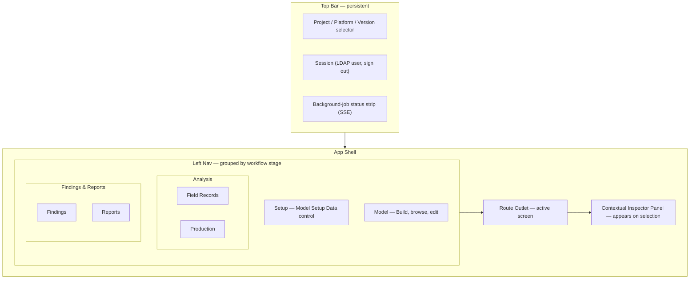
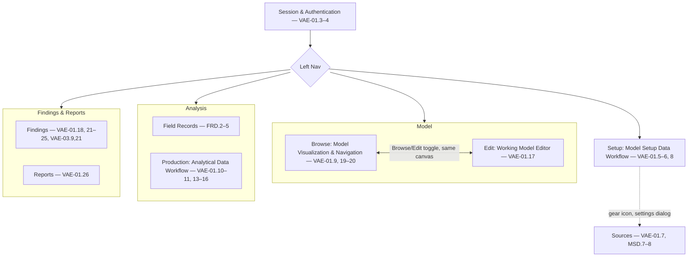

# UI/UX Design Document (UXD): System as a Graph (SaaG)

**Definition:** This UXD specifies the visual identity, layout system, interaction patterns, and performance targets for **VAE-01, the Operations Panel** — the sole user-facing surface of the SaaG CSCI. It covers the web application only; the CLI half of VAE-01 (VAE-01.27) is a text-output automation interface and has no visual UX surface.

**Purpose:** `SDD.md` §3.6.1 already fixes *what* each VAE-01 screen does and *which* SRS requirements it satisfies. This document fixes *how it looks and feels* — the design tokens, layout shell, and interaction patterns that make the Operations Panel read as a premium, high-performance instrument rather than a generic admin CRUD app — using only the technologies already committed to in `SDP.md` §5 Table 6.

---

## 1. Design Principles

1. **Instrument, not brochure.** Every screen is a working surface for an operator staring at it for hours — density and legibility beat whitespace and marketing polish.
2. **Trust through clarity.** Findings, severities, and conformance status must read unambiguously at a glance; the same severity scale is reused everywhere (graph, tables, charts) so an operator never re-learns a color.
3. **Non-destructive editing must be visually loud.** The Working Model (VAE-01.17) is a sandbox derived from the read-only Core System Model (SDD §1 decision 4) — the UI must make it impossible to mistake one for the other at any zoom level.
4. **Performance is a UX requirement, not an afterthought.** Graph pan/zoom and high-volume trace charts are the product's core interaction; a sluggish canvas undermines the "premium" goal more than any visual choice does.
5. **Dark-first, light-second.** The primary experience is a dark "control room" surface; light mode is a fully-supported, token-driven alternate, not an afterthought — both are first-class via shadcn/ui's native theming, no separate design.

---

## 2. Visual Identity (Design Tokens)

Tokens are expressed as shadcn/ui-style CSS custom properties (HSL triples, consumed by Tailwind CSS ~3.4 via `hsl(var(--x))`) so they drop directly into the stack fixed in `SDP.md` §5 Table 6 — no new theming library.

### 2.1 Color — dark (default) and light

| Token | Dark (default) | Light | Use |
|---|---|---|---|
| `--background` | `222 47% 6%` | `210 20% 98%` | App canvas background |
| `--foreground` | `210 20% 92%` | `222 47% 11%` | Primary text |
| `--card` | `222 40% 9%` | `0 0% 100%` | Panels, inspector, dialogs |
| `--card-foreground` | `210 20% 92%` | `222 47% 11%` | Text on panels |
| `--border` | `222 25% 18%` | `220 13% 91%` | Panel/table/graph-node borders |
| `--muted` | `222 25% 14%` | `220 14% 96%` | Secondary surfaces, disabled state |
| `--muted-foreground` | `215 15% 60%` | `220 9% 43%` | Secondary text, labels |
| `--primary` | `199 89% 55%` | `199 89% 42%` | Primary actions, active nav, links |
| `--primary-foreground` | `222 47% 6%` | `210 20% 98%` | Text/icons on primary |
| `--destructive` | `0 72% 51%` | `0 72% 45%` | Destructive actions |
| `--ring` | `199 89% 55%` | `199 89% 42%` | Focus ring (both themes) |
| `--radius` | `0.375rem` | `0.375rem` | Base corner radius (tight, not marketing-rounded) |

### 2.2 Severity & status scale (reused across graph nodes, findings tables, charts)

| Token | Dark (default) | Light | Meaning |
|---|---|---|---|
| `--status-critical` | `0 72% 51%` | `0 72% 42%` | Critical finding / blocking |
| `--status-high` | `24 95% 53%` | `24 95% 36%` | High severity |
| `--status-medium` | `45 93% 47%` | `45 93% 28%` | Medium severity |
| `--status-low` | `215 20% 55%` | `215 20% 44%` | Low severity |
| `--status-info` | `199 89% 55%` | `199 89% 42%` | Informational (aliases `--primary`'s light value — see usage note) |
| `--status-conforming` | `142 71% 45%` | `142 71% 24%` | Conforming / success |
| `--status-non-conforming` | `0 72% 51%` | `0 72% 42%` | Non-conforming (aliases `--status-critical`) |

This is the *only* color vocabulary allowed for status meaning anywhere in the app — a critical finding, a red graph-node border, and a red chart bar must all be the same token. Like §2.1's core tokens, each status token carries its own light-mode value so it holds WCAG AA contrast in both themes, rather than reusing one dark-tuned value everywhere.

**Usage contract:** status tokens are dots, borders, and fills (graph-node borders, table row accents, chart series, KPI badges) — never a standalone body-text color. Every token clears 3:1 (WCAG AA for graphics/large text) against its theme's `--background`; all except `--status-info` also clear 4.5:1 (AA body text), so they're safe as small text labels too. `--status-info`'s light value intentionally reuses `--primary`'s light value to stay visually tied to primary actions/links rather than becoming an unreadably dark navy — pair it with `--foreground` text rather than coloring text `--status-info` directly.

### 2.3 Typography

| Role | Font | Notes |
|---|---|---|
| UI text | **Geist Sans** | Self-hosted via `next/font` in Next.js ^14.2 — zero layout shift, zero external request (supports §6 performance budget) |
| IDs, attributes, code, topic/message payloads | **Geist Mono** | Same font family, self-hosted the same way; used for anything that must align in columns (node IDs, finding IDs, JSON) |

Compact type scale for information density: `11px` (table meta/captions) / `12px` (dense table body, monospace IDs) / `13px` (default body) / `14px` (form labels, nav) / `16px` (section headers) / `20px`/`24px` (page titles only). Numeric columns (counts, scores, latencies) use `font-variant-numeric: tabular-nums` throughout findings tables and charts.

### 2.4 Spacing, elevation, motion

- **Spacing:** 4px base grid; standard steps `4/8/12/16/24/32`. Table row height and form field padding stay on the tight end (`8`–`12`) to maximize on-screen data.
- **Elevation tiers** (z-index + shadow, `--card` background at every tier above 0): `0` graph canvas (flat, no shadow — it's the ground plane), `10` docked panels (inspector, side nav), `20` modals/dialogs, `30` toasts and command palette.
- **Motion:** `120ms` micro (hover/focus/checkbox), `180ms` panel slide/fade, `240ms` modal enter/exit; `ease-out` on enter, `ease-in` on exit. **The React Flow viewport itself is never CSS-animated** — pan/zoom uses React Flow's native transform only, so canvas interaction stays decoupled from the app's motion system and off the main-thread layout/paint path.

---

## 3. App Shell & Navigation

The shell is a persistent Next.js layout; only the route outlet swaps. Left nav is grouped by workflow stage, mirroring the CSU groupings in `SDP.md` §2, so the nav structure never has to be redesigned as increments ship new screens into existing groups.

**Figure 1. App Shell & Navigation**



- **Top bar**: project/platform/system-version selector (VAE-01.4) is always visible so the operator never loses track of which effective version they're on; the job-status strip surfaces any in-flight MSD/production/evaluation operation (Procrastinate-backed, SSE-delivered) regardless of which screen is open.
- **Left nav**: four groups — Setup, Model, Analysis, Findings & Reports. **Analysis** (Field Records, Production — FRD.2–5 / VAE-01.10–11, 13–16) and **Findings & Reports** (Findings, Reports — VAE-01.18, 21–25 / VAE-01.26) each split into two subpages, since each pair is a different artifact, not two views of one. **Model** and **Setup** stay single pages: Model's Browse/Edit is an in-page toggle on one shared canvas, not a nav split. Setup's per-source configuration (VAE-01.7, MSD.7–8) lives behind a gear-icon settings dialog instead of a nav subpage, since it's configured rarely (see §4).
- **Pipeline-progress badges**: each Left-nav group carries a small status dot using a dedicated two-state readiness indicator — `--muted` (not yet available) vs. `--status-conforming` (has usable output) — deliberately not the full severity/status scale (§2.2), so a nav dot can never be misread as a critical/high finding on a group that simply hasn't run yet. It reflects whether its pipeline stage has usable output yet for the active project/platform/version — e.g., Setup stays `--muted` until an MSD file exists, Model until a Core System Model is built, Analysis until bound analytical data exists, Findings & Reports until findings exist, each turning `--status-conforming` once its stage has output. This is a snapshot of pipeline completeness, distinct from the job-status strip's live in-flight-operation view, and gives an operator who doesn't already know the pipeline order a self-guided path through the four stages.
- **Inspector panel**: a single reusable right-docked panel (elevation tier 10) used by both the graph (node/edge detail) and the findings table (finding detail) — one component, one interaction pattern, two data sources.

---

## 4. Screen-by-Screen UX

Each screen below maps to VAE-01 requirements as grouped by actual UX/page boundaries, cross-referenced to the nearest SDD §3.6.1.2 design element; the SRS ID range is carried over unchanged for traceability. Four groupings are refined versus SDD's presentation:
- VAE-01.9 (build Core System Model) ships with Model Visualization, not with Setup.
- Findings & Reporting splits into Findings and Reports.
- Analysis splits into Field Records (FRD.2–5) and Production.
- Setup's source configuration (MSD.7–8) is a settings dialog, not a page; Findings carries VAE-03.9/21's summary KPI strip.

**Figure 2. Screen Navigation Flow**



**Session & Authentication** — *VAE-01.3–4* — Centered single-card login on the full dark background, no shell chrome until authenticated. LDAP credential form (React Hook Form + shadcn `Form`/`Input`), guarded by Refine's access-control provider (§5). Post-login: project/platform/version selection if none is active yet, otherwise the operator's last-visited screen for that context, falling back to Model Visualization & Navigation.

```text
┌────────────────────────────────────────────────────────────────────────────────────────────┐
│                                                                                            │
│                  (bare dark canvas — no shell chrome until authenticated)                  │
│                                                                                            │
│                         ┌──────────────────────────────────────────┐                       │
│                         │         SaaG — Operations Panel          │                       │
│                         ├──────────────────────────────────────────┤                       │
│                         │ Username  [______________________]       │                       │
│                         │ Password  [______________________]       │                       │
│                         │                                          │                       │
│                         │               [ Sign in ]                │                       │
│                         │ ! Auth failed — invalid credentials (§7) │                       │
│                         └──────────────────────────────────────────┘                       │
│                                                                                            │
└────────────────────────────────────────────────────────────────────────────────────────────┘
```

**Sources** *(settings dialog, not a nav page)* — *VAE-01.7, MSD.7–8* — Opened via a gear icon on the Setup page header, not the left nav. A modal (tier 20) with one card per data source — config-mgmt DB, source-code repo, package repo, network topology — each editable (source type/name, access method, address, credentials; React Hook Form + shadcn `Form`/`Input`/`Dialog`). Network topology also offers a manual-entry toggle (MSD.7) as an alternative to automatic acquisition. Live accessibility status (status-scale dots, VAE-01.7) shows per card and, summarized, on the Setup page header.

```text
┌────────────────────────────────────────────────────────────────────────────────────────────┐
│ Project v   Platform v   Version v 2.3.1          user@ldap   [sign out]                   │
│ Setup — Model Setup Data Workflow   (dimmed backdrop)                                      │
│ .......................................................................................... │
│           ┌──────────────────────────────────────────────────────────────────────┐         │
│           │                 Sources  (settings dialog · tier 20)                 │         │
│           ├──────────────────────────────────────────────────────────────────────┤         │
│           │ * Config-mgmt DB    type / name / address / credentials              │         │
│           │ * Source-code repo  type / name / address / credentials              │         │
│           │ * Package repo      type / name / address / credentials              │         │
│           │ * Network topology   address / credentials                           │         │
│           │     [ ] manual-entry toggle (MSD.7, alt. to auto-acquire)            │         │
│           ├──────────────────────────────────────────────────────────────────────┤         │
│           │                     [ Cancel ]          [ Save ]                     │         │
│           └──────────────────────────────────────────────────────────────────────┘         │
│ .......................................................................................... │
└────────────────────────────────────────────────────────────────────────────────────────────┘
```
Opened via the gear icon on the Setup page header (below). Each card's `*` marker stands in
for the live per-source status dot (two-state readiness scale, §3).

**Setup: Model Setup Data Workflow** — *VAE-01.5–6, 8* — A stepper-style status view: file list from the selected Model Setup Data file, plus a production trigger with progress fed by the top-bar job strip. Errors (missing-data/access/authorization/format/integrity) surface inline via the §7 error-state convention. On success, the trigger is replaced by a **"Continue to Model →"** CTA that navigates to the Model page — it only navigates; the build itself happens there via the Model page's own **"Build Model"** trigger, so the two labels are kept distinct on purpose. The page header carries the gear icon that opens the Sources dialog.

```text
┌────────────────────────────────────────────────────────────────────────────────────────────┐
│ Project v   Platform v   Version v 2.3.1          user@ldap   [sign out]                   │
│ Setup — Model Setup Data Workflow                                                          │
├────────────────────────────────────────────────────────────────────────────────────────────┤
│ > Setup    │ Model Setup Data Workflow                                 [gear icon: Sources]│
│   Model    │ ------------------------------------------------------------------------------│
│   Analysis │ Selected MSD file: msd_2026-07-14_platformA.json                              │
│   Findings │                                                                               │
│            │ File list                                                                     │
│            │   msd_2026-07-14_platformA.json                                          ready│
│            │   msd_2026-06-30_platformA.json                                          ready│
│            │                                                                               │
│            │ [ Produce Model Setup Data ]           status: running 63% (top-bar job strip)│
│            │                                                                               │
│            │ ! missing-data/access/authorization/format/integrity errors (inline, §7)      │
│            │                                                                               │
│            │           [ Continue to Model -> ]  (replaces trigger, success only)          │
└────────────┴───────────────────────────────────────────────────────────────────────────────┘
```

**Field Records** — *FRD.2–5* — TanStack Table catalog of all uploaded System Field Records — searchable/filterable by project, platform, system version, source, or upload time (FRD.4). Upload action (React Hook Form, file input) records source, time, and project/platform/version (FRD.2–3), with format/integrity/missing-field errors surfaced inline via §7 (FRD.5). Referenced as the table-pattern example in §5.

```text
┌────────────────────────────────────────────────────────────────────────────────────────────┐
│ Project v   Platform v   Version v 2.3.1          user@ldap   [sign out]                   │
│ Analysis — Field Records                                                                   │
├────────────────────────────────────────────────────────────────────────────────────────────┤
│   Setup    │ Field Records                                                                 │
│   Model    │ ------------------------------------------------------------------------------│
│ > Analysis │ Filter: [Project v] [Platform v] [Version v] [Source v]   Search: [..........]│
│   Findings │                                                                               │
│            │ ID       Project   Platform     Version   Source        Uploaded              │
│            │ -------  --------  -----------  --------  ------------  -----------           │
│            │ FR-101   SaaG      linux-x86    2.3.1     field-gw-1    2026-07-14            │
│            │ FR-100   SaaG      linux-x86    2.3.0     field-gw-2    2026-07-10            │
│            │ ...      ...       ...          ...       ...           ...                   │
│            │                                                                               │
│            │ [ Upload Field Record ]  records source, time, project/platform/version;      │
│            │                          format/integrity/missing-field errors inline (§7)    │
└────────────┴───────────────────────────────────────────────────────────────────────────────┘
```

**Analytical Data Workflow** *(Production)* — *VAE-01.10–11, 13–16* — Source-choice toggle — System Field Records vs. SCG synthetic scenario, mutually exclusive per `SDD.md` §3.4.1 — driving a conditional form (React Hook Form): either record selection against the Field Records catalog (VAE-01.12), or a scenario-input form (scope, type, interval, density, data types). Binding status against the Core System Model is the final stage, shown as a compact progress card once CSM-02 completes. One continuous page, not a separate one.

```text
┌────────────────────────────────────────────────────────────────────────────────────────────┐
│ Project v   Platform v   Version v 2.3.1          user@ldap   [sign out]                   │
│ Analysis — Production                                                                      │
├────────────────────────────────────────────────────────────────────────────────────────────┤
│   Setup    │ Production — Analytical Data Workflow                                         │
│   Model    │ ------------------------------------------------------------------------------│
│ > Analysis │ Source:  ( o Field Records )   (   SCG Scenario   )      <- mutually exclusive│
│   Findings │                                                                               │
│            │   Field Records branch:              SCG Scenario branch (if selected):       │
│            │   Select record(s) from the           Scope / Type / Interval / Density /     │
│            │   Field Records catalog               Data types  (form)                      │
│            │                                                                               │
│            │ [ Produce Analytical Data ]      status: queued / running / succeeded / failed│
│            │                                                                               │
│            │ Binding vs. Core System Model (CSM-02):                        [progress card]│
└────────────┴───────────────────────────────────────────────────────────────────────────────┘
```

**Working Model Editor** — *VAE-01.17* — Same graph canvas as Model Visualization, entered via an in-page Browse/Edit toggle rather than a separate nav destination. A persistent, non-dismissable amber `--status-medium` banner and border mark it as distinct from read-only browsing; selecting a node or edge opens the same Inspector Panel, but its fields become editable (React Hook Form + shadcn) — the canvas itself is never directly editable. Every add/remove/edit is an explicit, undoable step; edits live only in the Working Model store (`SDD.md` §2.4), scoped to the active project/platform/version, never autosaved to the Core System Model. Switching Project/Platform/Version with unsaved edits pending prompts a confirmation dialog (shadcn `AlertDialog`); switching left-nav groups mid-edit is safe, since the edits persist in the store and the amber banner reappears on return.

```text
┌────────────────────────────────────────────────────────────────────────────────────────────┐
│ Project v   Platform v   Version v 2.3.1          user@ldap   [sign out]                   │
│ Model — Edit (Working Model)                                                               │
├────────────────────────────────────────────────────────────────────────────────────────────┤
│   Setup    │ Working Model Editor (Browse | Edit toggle)            | Inspector            │
│ > Model    │ -------------------------------------------------------| ---------------------│
│   Analysis │ WORKING MODEL — sandboxed, never autosaved             | Selected:            │
│   Findings │   (persistent amber --status-medium banner/border)     |  node-042            │
│            │     [node] --edge--> [node]                            |                      │
│            │       |                 |                              | Fields (editable)    │
│            │     [node]           [node]  (canvas, tier 0)          |  name                │
│            │                                                        |  [_________]         │
│            │ [+ Add node] [+ Add edge] [Undo] -- explicit/undoable  |  attrs               │
│            │                                                        |  [_________]         │
└────────────┴───────────────────────────────────────────────────────────────────────────────┘
```

**Model Visualization & Navigation** — *VAE-01.9, 19–20* — Full-bleed React Flow canvas (tier 0) with a floating top-left search/filter bar (type/project/platform/version/software-unit) and a bottom-right minimap. Selecting a node or edge opens the shared Inspector Panel (§3). If no Core System Model exists yet for the selected project/platform/version, the canvas is replaced by a "Build Model" trigger and progress state (VAE-01.9), fed by the top-bar job strip.

```text
┌────────────────────────────────────────────────────────────────────────────────────────────┐
│ Project v   Platform v   Version v 2.3.1          user@ldap   [sign out]                   │
│ Model — Browse                                                                             │
├────────────────────────────────────────────────────────────────────────────────────────────┤
│   Setup    │ Model Visualization & Navigation (Browse|Edit)         | Inspector            │
│ > Model    │ -------------------------------------------------------| ---------------------│
│   Analysis │ [search/filter: type|project|platform|version|unit]    | (appears on          │
│   Findings │   (floating, top-left)                                 |  node/edge           │
│            │     [node] --edge--> [node]                            |  selection)          │
│            │       |                 |   full-bleed canvas          |                      │
│            │     [node]           [node]  (tier 0)                  | id, type,            │
│            │                                                        | attrs                │
│            │                                   [minimap]            |                      │
│            │                          (floating, bottom-right)      |                      │
└────────────┴───────────────────────────────────────────────────────────────────────────────┘
```
Empty state (no Core System Model yet for this project/platform/version): the canvas area is
replaced by a "Build Model" trigger + progress, fed by the top-bar job strip.

**Findings** — *VAE-01.18, 21–25, VAE-03.9, 21* — TanStack Table findings list — severity-colored, sortable/filterable — headed by a KPI/summary strip (Recharts/shadcn Chart, §5's low-cardinality rule) surfacing the entities with highest resource usage or messaging intensity (VAE-03.9, 21). Row selection opens the Inspector Panel with full finding detail: evidence, related rule, cause/effect chain, and (for simulation-sourced findings) the scenario name/inputs/production time. Interrupted operations show error cause, stage, and time inline via §7.

```text
┌────────────────────────────────────────────────────────────────────────────────────────────┐
│ Project v   Platform v   Version v 2.3.1          user@ldap   [sign out]                   │
│ Findings & Reports — Findings                                                              │
├────────────────────────────────────────────────────────────────────────────────────────────┤
│   Setup    │ Findings                                                   | Inspector        │
│   Model    │ -----------------------------------------------------------| -----------------│
│   Analysis │ KPI strip: [Top resource-usage] [Top msg-intensity]        | Selected:        │
│ > Findings │                                                            |  F-08            │
│            │ Filter: [Severity v] [Type v] [Project v]  Search: [......]|                  │
│            │                                                            | Evidence,        │
│            │ ID     Sev   Type          Entity          Rule    Related | related          │
│            │ -----  ----  ------------  --------------  ------  --------| rule,            │
│            │ F-08   CRIT  circular-dep  svc-gateway     AR-03   F-09    | cause/           │
│            │ F-07   HIGH  qos-mismatch  topic/telemetry QOS-02  -       | effect           │
│            │ F-06   MED   unmatched     topic/health    PC-01   -       | chain,           │
│            │                                                            | scenario         │
│            │                                                            | (if sim.)        │
└────────────┴───────────────────────────────────────────────────────────────────────────────┘
```

**Reports** — *VAE-01.26* — A subpage under Findings & Reports: a list of previously generated reports, plus a generate action producing a summary or detailed report (PDF/JSON) that synthesizes verification (VAE-02), analysis (VAE-03), and evaluation (VAE-04) results for the selected project/platform/version.

```text
┌────────────────────────────────────────────────────────────────────────────────────────────┐
│ Project v   Platform v   Version v 2.3.1          user@ldap   [sign out]                   │
│ Findings & Reports — Reports                                                               │
├────────────────────────────────────────────────────────────────────────────────────────────┤
│   Setup    │ Reports                                                                       │
│   Model    │ ------------------------------------------------------------------------------│
│   Analysis │ [ Generate report v ]  ( summary | detailed )       format:  ( PDF )  ( JSON )│
│ > Findings │                                                                               │
│            │ Name                             Type        Generated     Format             │
│            │ --------------------------------  ----------  ------------  --------          │
│            │ SaaG-2.3.1-summary-2026-07-14     summary     2026-07-14    PDF               │
│            │ SaaG-2.3.0-detailed-2026-07-01    detailed    2026-07-01    JSON              │
│            │                                                                               │
│            │ Synthesizes VAE-02/VAE-03/VAE-04 for the active project/platform/version.     │
└────────────┴───────────────────────────────────────────────────────────────────────────────┘
```

---

## 5. Core Interaction Patterns

Cross-cutting patterns, each owned by exactly one library from `SDP.md` §5 Table 6 — no screen invents its own variant.

| Pattern | Owner | Rule |
|---|---|---|
| Graph canvas | React Flow ^12.11 | Search/filter, zoom/pan, click-to-select → Inspector Panel, minimap always present. Below a configurable node-count threshold (§6) render at full detail; above it, degrade to level-of-detail (labels hidden, edges simplified) until the operator zooms in. |
| Data tables | TanStack Table ^8.21 + shadcn/ui | Sort/filter/pagination and severity-colored rows are table-wide conventions, not per-screen choices; used by Findings, Reports, and the Field Records catalog. |
| Charts | Recharts ^3.9 + shadcn/ui Chart, or ECharts ^6.1 | **Decision rule:** low-cardinality summary/KPI/status charts (findings counts, conformance breakdowns, VAE-03.9/21's top resource-usage/messaging-intensity entities on the Findings page) use Recharts/shadcn Chart for tight design-system integration; high-volume field-trace data (message flow, resource usage, latency/loss — VAE-03) uses ECharts for its canvas-based rendering at scale. Both read the same severity/status token scale for series color. |
| Forms | React Hook Form ^7.81 + shadcn/ui | Inline, per-field validation errors, matching the CSCI-wide mandatory-field/format validation pattern already fixed in `SDD.md` §1 decision 5 — the UI never invents a different validation vocabulary than the backend's. |
| Background operations | Procrastinate (PostgreSQL) + SSE | One status-strip + toast pattern for every long-running operation (MSD production, AED production, evaluation runs): queued → running → succeeded/failed, with failure reason surfaced inline, not just in a toast. |
| Shell, routing & access control | Refine ^5.0 | Route guarding, session/auth redirects, and CRUD/resource data bindings underneath Login, Findings, Reports, and Field Records (`SDP.md` §5 Table 6) — supplies the plumbing beneath the visual-pattern owners above, not a visual pattern of its own. |

---

## 6. Performance Budget

Concrete, testable targets — the "outstanding performance" requirement is treated as a UX spec, not a hope.

| Target | Budget |
|---|---|
| Route time-to-interactive (Next.js route, warm cache) | < 1s |
| Graph pan/zoom frame rate | 60fps sustained up to the LOD threshold below |
| Graph level-of-detail threshold | Full detail below 1,000 nodes; simplified rendering above |
| Findings/report table virtualization threshold | Virtualize (TanStack Table + windowing) above 200 rows |
| Route-level code splitting | One Next.js route chunk per left-nav screen group (§3); no screen loads another group's JS |
| Editor responsiveness | Working Model edits apply optimistically via TanStack Query, reconciled against the server response, never blocking the canvas on a round-trip |
| Font loading | Geist Sans/Mono self-hosted via `next/font` — no external font request, no layout shift on first paint |

**Browser compatibility:** every token and pattern in this document (CSS custom properties, HSL colors, self-hosted fonts, SSE, React 18.3/Next.js 14.2/Radix/React Flow/Recharts/ECharts) runs on Firefox 90+ (and equivalent-era Chrome/Edge/Safari). Guardrail: Tailwind 3.4 makes it easy to reach for `:has()` (needs Firefox 121+) or CSS container queries (needs Firefox 110+) without noticing — avoid both if the 90+ floor must hold.

---

## 7. Accessibility & States

- **Contrast:** every `--foreground`/`--background` and `--*-foreground`/`--*` pairing in §2.1–2.2 must meet WCAG AA (4.5:1 body text, 3:1 large text/graphics) in both themes; the severity scale is chosen to stay distinguishable under common color-vision deficiencies (red/orange/amber/blue-gray/blue span both hue and lightness).
- **Keyboard:** the graph canvas, findings table, and Inspector Panel are all keyboard-navigable (arrow/tab traversal, Enter to open Inspector, Esc to close) — no interaction pattern is mouse-only.
- **States:** every data view (graph, table, form, chart) implements the same three non-happy-path states — **empty** (no data yet, with the action that produces it), **loading** (skeleton matching the eventual layout, not a spinner-only screen), **error** (inline, using `--status-critical`, with the same source/reason/time attributes the backend already records per `SDD.md` §1 decision 5) — so an operator learns the pattern once and reuses it everywhere.

---

## 8. Traceability

| UXD Section | VAE-01 SRS Reference |
|---|---|
| §4 Session & Authentication | VAE-01.3–4 |
| §4 Sources (settings dialog) | VAE-01.7, MSD.7–8 *(MSD.7–8 are cross-CSU: no VAE-01.x requirement covers source configuration directly; surfaced on VAE-01 as the CSCI's sole UI surface, per SRS Appendix A's "Joint" convention for cross-CSU cases; presented as a dialog off the Setup page rather than a nav page — see §3)* |
| §4 Setup: Model Setup Data Workflow | VAE-01.5–6, 8 |
| §4 Field Records | FRD.2–5 *(cross-CSU, same convention as Sources above)* |
| §4 Analytical Data Workflow (Production) | VAE-01.10–11, 13–16 |
| §4 Working Model Editor | VAE-01.17 |
| §4 Model Visualization & Navigation | VAE-01.9, 19–20 |
| §4 Findings | VAE-01.18, 21–25, VAE-03.9, 21 *(VAE-03.9/21 are cross-CSU: VAE-03 has no UI surface of its own, so its "summary evaluation indicators" requirement is presented on the Findings page)* |
| §4 Reports | VAE-01.26 |
| §5 Background operations status pattern | VAE-01.16, 27 (status delivery, shared pattern) |
| §7 Error-state convention | VAE-01.18 (conforming/non-conforming classification), SDD §1 decision 5 |
