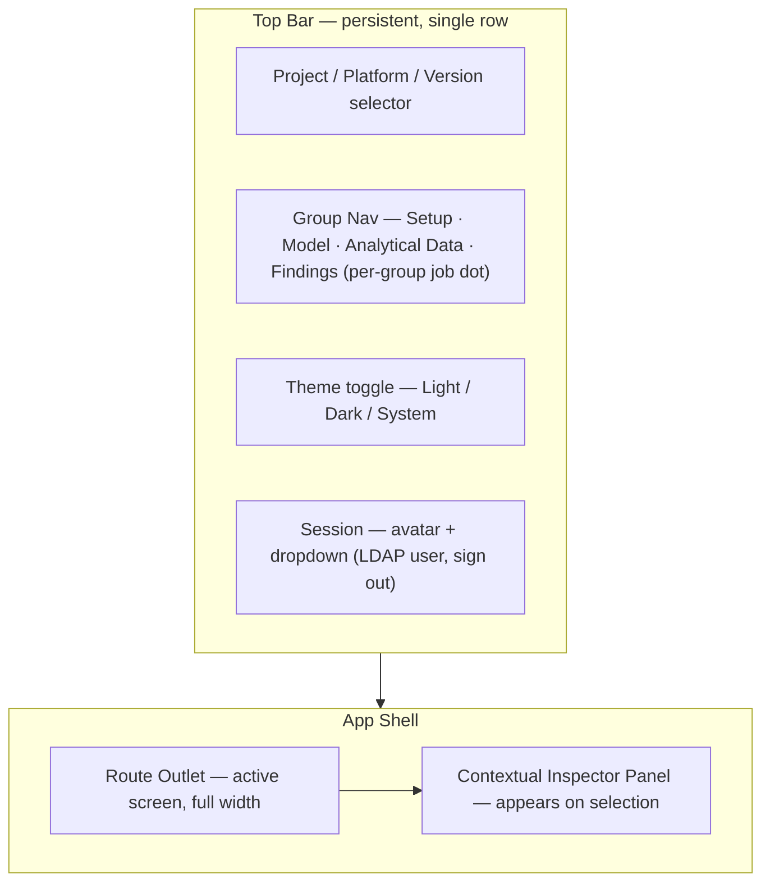

# UI/UX Design Document (UXD): System as a Graph (SaaG)

**Definition:** This UXD specifies the visual identity, layout system, interaction patterns, and performance targets for **VAE-01, the Operations Panel** — the sole user-facing surface of the SaaG CSCI. It covers the web application only; the CLI half of VAE-01 (VAE-01.27) is a text-output automation interface and has no visual UX surface.

**Purpose:** SDD §3.6.1 already fixes *what* each VAE-01 screen does and *which* SRS requirements it satisfies. This document fixes *how it looks and feels* — the design tokens, layout shell, and interaction patterns that make the Operations Panel read as a premium, high-performance instrument rather than a generic admin CRUD app — using only the technologies already committed to in SDP §5 Table 6.

---

## 1. Design Principles

1. **Instrument, not brochure.** Every screen is a working surface for an operator staring at it for hours — density and legibility beat whitespace and marketing polish.
2. **Trust through clarity.** Findings, severities, and conformance status must read unambiguously at a glance; the same severity scale is reused everywhere (graph, tables, charts).
3. **Non-destructive editing must be visually loud.** The Working Model (VAE-01.17) is a sandbox derived from the read-only Core System Model (SDD §1 decision 4) — the UI must make it impossible to mistake one for the other at any zoom level.
4. **Performance is a UX requirement, not an afterthought.** Graph pan/zoom and high-volume trace charts are the product's core interaction; a sluggish canvas undermines the "premium" goal more than any visual choice does.
5. **Dark-first, light-second.** Dark "control room" is primary; light is a fully-supported, token-driven alternate via shadcn/ui's native theming — no separate design.

---

## 2. Visual Identity (Design Tokens)

Tokens are shadcn/ui-style CSS custom properties (HSL triples via `hsl(var(--x))`), per the stack fixed in SDP §5 Table 6 — no new theming library.

### 2.1 Color — dark (default) and light

Neutral, near-monochrome palette — no brand hue in UI chrome. Primary actions are high-contrast inverted buttons (white-on-dark / black-on-light), not a colored accent; color-as-meaning is reserved for §2.2's severity/status scale.

**Table 1. Design Tokens — Color (Dark/Light)**

| Token | Dark (default) | Light | Use |
|---|---|---|---|
| `--background` | `0 0% 3.9%` | `0 0% 100%` | App canvas background |
| `--foreground` | `0 0% 98%` | `0 0% 3.9%` | Primary text |
| `--card` | `0 0% 6%` | `0 0% 100%` | Panels, inspector, dialogs |
| `--card-foreground` | `0 0% 98%` | `0 0% 3.9%` | Text on panels |
| `--border` | `0 0% 14.9%` | `0 0% 89.8%` | Panel/table/graph-node borders |
| `--muted` | `0 0% 14.9%` | `0 0% 96.1%` | Secondary surfaces, disabled state |
| `--muted-foreground` | `0 0% 63.9%` | `0 0% 45.1%` | Secondary text, labels |
| `--primary` | `0 0% 98%` | `0 0% 9%` | Primary actions, active nav — high-contrast inverted, not a color accent |
| `--primary-foreground` | `0 0% 9%` | `0 0% 98%` | Text/icons on primary |
| `--destructive` | `0 62.8% 30.6%` | `0 84.2% 60.2%` | Destructive actions |
| `--ring` | `0 0% 83.1%` | `0 0% 3.9%` | Focus ring (both themes) |
| `--radius` | `0.375rem` | `0.375rem` | Base corner radius (tight, not marketing-rounded) |

### 2.2 Severity & status scale (reused across graph nodes, findings tables, charts)

**Table 2. Severity & Status Scale**

| Token | Dark (default) | Light | Meaning |
|---|---|---|---|
| `--status-critical` | `0 72% 51%` | `0 72% 42%` | Critical finding / blocking |
| `--status-high` | `24 95% 53%` | `24 95% 36%` | High severity |
| `--status-medium` | `45 93% 47%` | `45 93% 28%` | Medium severity |
| `--status-low` | `215 20% 55%` | `215 20% 44%` | Low severity |
| `--status-info` | `199 89% 55%` | `199 89% 42%` | Informational — the palette's one deliberate accent hue, reserved for this scale (see §2.1's note) |
| `--status-conforming` | `142 71% 45%` | `142 71% 24%` | Conforming / success |
| `--status-non-conforming` | `0 72% 51%` | `0 72% 42%` | Non-conforming (aliases `--status-critical`) |

The *only* color vocabulary for status meaning app-wide: a critical finding, a red graph-node border, a red chart bar are all the same token — and, with §2.1's neutral chrome, the *only* hue in the app (Design Principle 2). Each token carries its own light-mode value for WCAG AA contrast in both themes.

**Usage contract:** status tokens are dots, borders, and fills only — never body text; pair with `--foreground` text instead. Every token clears 3:1 (graphics/large text); all but `--status-info` also clear 4.5:1 (body text), held in reserve. `--status-info` is its own value, not `--primary` — the palette's one deliberate accent.

### 2.3 Typography

**Table 3. Typography**

| Role | Font | Notes |
|---|---|---|
| UI text | **Geist Sans** | Self-hosted via `next/font` in Next.js ^14.2 — zero layout shift, zero external request (supports §6 performance budget) |
| IDs, attributes, code, topic/message payloads | **Geist Mono** | Same font family, self-hosted the same way; used for anything that must align in columns (node IDs, finding IDs, JSON) |

Compact type scale: `11px` (meta/captions) / `12px` (table body, monospace IDs) / `13px` (body) / `14px` (labels, nav) / `16px` (section headers) / `20px`/`24px` (KPI values) / `30px` bold (page titles only, §5). Numeric columns use `tabular-nums` throughout.

### 2.4 Spacing, elevation, motion

- **Spacing:** 4px base grid; standard steps `4/8/12/16/24/32`. Table row height and form field padding stay on the tight end (`8`–`12`) to maximize on-screen data.
- **Elevation tiers** (z-index + shadow, `--card` background at every tier above 0): `0` graph canvas (flat, no shadow — it's the ground plane), `10` docked panels (inspector) and the persistent top bar, `20` modals/dialogs, `30` toasts and command palette.
- **Motion:** `120ms` micro (hover/focus/checkbox), `180ms` panel slide/fade, `240ms` modal enter/exit; `ease-out` in, `ease-in` out. React Flow's viewport is never CSS-animated — pan/zoom uses its native transform only.

---

## 3. App Shell & Navigation

The shell is a persistent Next.js layout; only the route outlet swaps. Group navigation lives in the top bar rather than a left sidebar, grouped by workflow stage, mirroring the CSU groupings in SDP §2.

**Figure 1. App Shell & Navigation**


```mermaid
flowchart TB
    subgraph TOPBAR["Top Bar — persistent, single row"]
        PPV["Project / Platform / Version selector"]
        GROUPNAV["Group Nav — Setup · Model · Analytical Data · Findings (per-group job dot)"]
        THEME["Theme toggle — Light / Dark / System"]
        SESSION["Session — avatar + dropdown (LDAP user, sign out)"]
    end
    subgraph SHELL["App Shell"]
        MAIN["Route Outlet — active screen, full width"]
        INSPECT["Contextual Inspector Panel — appears on selection"]
    end
    TOPBAR --> SHELL
    MAIN --> INSPECT
```

- **Top bar**: one persistent row — project/platform/version selector (VAE-01.4), group nav, a Light/Dark/System theme toggle, avatar dropdown (LDAP user, sign out). No left sidebar; the route outlet always spans full width.
- **Group nav**: four groups — Setup, Model, Analytical Data, Findings — each one page, no subpages. Active state: bold `--foreground` vs. `--muted-foreground` text, not a pill (pills are for in-page tabs, §5). Three groups push further content behind in-page toggles instead:
  - **Model** toggles Browse/Edit on one shared canvas.
  - **Analytical Data** toggles Field Records/Scenario Generator (FRD.2–5, VAE-01.10, 12, 15–16 / VAE-01.11, 13–16) on one shared screen — the same pattern as Model.
  - **Findings**: four-way toggle — **Verification**, **Analysis**, **Evaluation** (split by which of VAE-02/03/04 produced results), plus **Reports** across all three.
- **Background-job indicator**: each group carries a dot for its own in-flight MSD/production/evaluation ops (Procrastinate + SSE) — blinking while running, solid `--status-conforming`/`--status-critical` once finished and not yet viewed, gone once the operator has visited the page. No separate status-strip element; the signal lives on the nav item it's about.
- **Inspector panel**: one reusable right-docked panel (tier 10) for both graph (node/edge) and findings-table (finding) detail.

---

## 4. Screen-by-Screen UX

Each screen maps VAE-01 requirements to actual UX/page boundaries (nearest SDD §3.6.1.2 element; SRS IDs unchanged). Four refinements versus SDD:
- **Model build placement:** VAE-01.9 (build Core System Model) ships with Model Visualization, not Setup.
- **Findings toggle:** Findings toggles Verification (VAE-02) / Analysis (VAE-03) / Evaluation (VAE-04) / Reports, the last a shared tab across all three.
- **Analytical Data toggle:** Analytical Data toggles Field Records (FRD.2–5, VAE-01.10, 12, 15–16) / Scenario Generator (VAE-01.11, 13–16) by data source.
- **Analysis KPI strip:** Analysis carries VAE-03.9/21's KPI strip.

**Session & Authentication** — *VAE-01.3–4* — Two-column split: brand mark plus centered login card on the left, a full-bleed cover photo on the right (hidden below `lg`); no shell chrome until authenticated. LDAP form (React Hook Form + shadcn), guarded by Refine's access-control provider (§5). Post-login: project/platform/version selection if none active, else last-visited screen, else Model Visualization & Navigation.

**Figure 2. Session & Authentication — Login Screen**

```text
┌────────────────────────────────────────────────────────────────────────────────────────┐
│ (icon) SaaG                                 │                                          │
│                                              │                                          │
│                                              │                                          │
│              ┌────────────────────┐         │            (cover photo,                │
│              │ Login to your      │         │             hidden below lg)             │
│              │ account            │         │                                          │
│              │ Enter your username│         │                                          │
│              │ and password...    │         │                                          │
│              │ Username  [______] │         │                                          │
│              │ Password  [______] │         │                                          │
│              │                    │         │                                          │
│              │    [ Sign in ]     │         │                                          │
│              │ ! Auth failed (§7) │         │                                          │
│              └────────────────────┘         │                                          │
│                                              │                                          │
└────────────────────────────────────────────────────────────────────────────────────────┘
```

**Setup** — *VAE-01.5–8, MSD.7–8* — Two stacked sections under the page header. **Sources**: a collapsible summary row (VAE-01.7) — a status dot + label per source type (not-configured/pending/reachable/unreachable) plus an overall badge ("all reachable" / "checking…" / "attention needed" / "N not configured"); expanding it swaps to a full table (type, name, address, credential, edit/delete) for scopes with more than one source of a type. **Edit** and **Add source** both open a shadcn `Dialog` form (source type, access method — read-only, derived from type —, name, connection address, username, priority, secret); there is no separate manual-entry toggle for network topology, it shares the same generic address field as the other three source types. **Production**: a "Produce Model Setup Data" button (disabled without a configured CMDB source, while a run is active, or mid-submit) above a paginated (TanStack Table) history of past runs — status badge (running/succeeded/failed), file path, started/duration/finished timestamps, entity/relation counts, and a Select action once succeeded; a failed or still-running run's errors expand inline per row rather than surfacing only in aggregate. Progress and outcome are also reflected on the Setup group's nav-item dot (§3), not a top-bar strip. On selecting a succeeded run, **"Continue to Model →"** navigates to the Model page — the build itself happens there via Model's own **"Build Model"** trigger.

**Figure 3. Setup**

```text
┌────────────────────────────────────────────────────────────────────────────────────────┐
│ Project v Platform v Version v 2.3.1 [Setup] Model Analytical Data Findings ☀ avatar v │
│ Setup                                                  [ Produce Model Setup Data ]     │
├────────────────────────────────────────────────────────────────────────────────────────┤
│ > Sources  [all reachable]                                          [ Add source ]     │
│   * config-mgmt DB [Edit]  * source repo [Edit]  * package repo [Add]  * net topo [Add]│
│                                                                                        │
│ Status    File                Started      Duration  Finished     Entities  Relations  │
│ ------    ----                -------      --------  --------     --------  ---------  │
│ succeeded msd_...platformA...  2026-07-14   2m 10s    2026-07-14   1204      3311  [Select]│
│ ▸ failed  —                    2026-07-10   0m 42s    2026-07-10   —         —     (1 error)│
│                                                                                        │
│ Selected MSD file: msd_2026-07-14_platformA.json           [ Continue to Model → ]     │
└────────────────────────────────────────────────────────────────────────────────────────┘
```

**Field Records** — *FRD.2–5, VAE-01.10, 12, 15–16* — TanStack Table of uploaded System Field Records, filterable by project/platform/version/source/upload time (FRD.4). Upload (React Hook Form, file input) records source/time/project/platform/version (FRD.2–3); errors inline via §7 (FRD.5). Table-pattern example for §5.

Selecting records and **Produce Analytical Data** (VAE-01.10, 12) starts AED production (VAE-01.15); binding vs. Core System Model is the final stage, a progress card once CSM-02 completes (VAE-01.16). Entered via the Field Records/Scenario Generator toggle, like Model's Browse/Edit.

**Figure 4. Field Records**

```text
┌────────────────────────────────────────────────────────────────────────────────────────┐
│ Project v Platform v Version v 2.3.1 Setup Model [Analytical Data] Findings avatar v   │
│ Field Records                                                   [ Upload Field Record ]│
│ ( Field Records )   Scenario Generator                                                 │
├────────────────────────────────────────────────────────────────────────────────────────┤
│ Filter: [Project v] [Platform v] [Version v] [Source v]  Search: [........]            │
│                                                                                        │
│ ID      Project  Platform    Version  Source      Uploaded                             │
│ ------  -------  ----------  -------  ----------  ----------                           │
│ FR-101  SaaG     linux-x86   2.3.1    field-gw-1  2026-07-14                           │
│ FR-100  SaaG     linux-x86   2.3.0    field-gw-2  2026-07-10                           │
│ ...     ...      ...         ...      ...         ...                                  │
│                                                                                        │
│ records source, time, project/platform/version; format/integrity/                      │
│ missing-field errors inline (§7)                                                       │
│                                                                                        │
│ [ Produce Analytical Data ]                     status: queued/running/succeeded/failed│
│                                                                                        │
│ Binding vs. Core System Model (CSM-02):                                 [progress card]│
└────────────────────────────────────────────────────────────────────────────────────────┘
```

**Scenario Generator** — *VAE-01.11, 13–16* — Form: scope, type, interval, density, data types (VAE-01.11, 13). **Produce Synthetic Data** tracks production, errors inline via §7 (VAE-01.14); **Produce Analytical Data** then starts AED production against it (VAE-01.15). Binding vs. Core System Model is final, a progress card once CSM-02 completes (VAE-01.16).

Entered via the same Field Records/Scenario Generator toggle — the tab itself is the source choice.

**Figure 5. Scenario Generator**

```text
┌────────────────────────────────────────────────────────────────────────────────────────┐
│ Project v Platform v Version v 2.3.1 Setup Model [Analytical Data] Findings avatar v   │
│ Scenario Generator                                           [ Produce Synthetic Data ]│
│   Field Records   ( Scenario Generator )                                               │
├────────────────────────────────────────────────────────────────────────────────────────┤
│ Scope / Type / Interval / Density / Data types  (form)                                 │
│                                                                                        │
│ [ Produce Analytical Data ]                     status: queued/running/succeeded/failed│
│                                                                                        │
│ Binding vs. Core System Model (CSM-02):                                 [progress card]│
└────────────────────────────────────────────────────────────────────────────────────────┘
```

**Working Model Editor** — *VAE-01.17* — Same canvas as Model Visualization, via a Browse/Edit toggle. A persistent amber `--status-medium` banner/border marks it as non-read-only; selecting a node/edge opens the same Inspector Panel, now editable (React Hook Form + shadcn) — the canvas itself stays non-editable. Every edit is explicit and undoable; edits live only in the Working Model store (SDD §2.4), never autosaved to the Core System Model.

Unsaved edits + Project/Platform/Version switch prompts a confirmation dialog (shadcn `AlertDialog`); switching top-bar groups mid-edit is safe — edits persist, banner reappears on return.

**Figure 6. Working Model Editor**

```text
┌────────────────────────────────────────────────────────────────────────────────────────┐
│ Project v Platform v Version v 2.3.1 Setup [Model] Analytical Data Findings avatar v   │
│ Working Model Editor                                                                   │
│   Browse   ( Edit )                                                                    │
├────────────────────────────────────────────────────────────────────────────────────────┤
│ Inspector →                                                      |                     │
│ -----------------------------------------------------------------| --------------------│
│ WORKING MODEL — sandboxed, never autosaved                       | Selected:           │
│   (persistent amber --status-medium banner/border)               | node-042            │
│     [node] --edge--> [node]                                      |                     │
│       |            |                                             | Fields (editable)   │
│     [node]      [node]  (canvas, tier 0)                         | name                │
│                                                                  | [________]          │
│ [+ Add node] [+ Add edge] [Undo] -- explicit/undoable            | attrs               │
│                                                                  | [________]          │
└────────────────────────────────────────────────────────────────────────────────────────┘
```

**Model Visualization & Navigation** — *VAE-01.9, 19–20* — Full-bleed React Flow canvas (tier 0), floating top-left search/filter bar (type/project/platform/version/unit), bottom-right minimap. Node/edge selection opens the Inspector Panel (§3). No Core System Model yet: canvas replaced by a "Build Model" trigger + progress (VAE-01.9), reflected on the Model group's nav-item dot (§3).

**Figure 7. Model Visualization & Navigation**

```text
┌────────────────────────────────────────────────────────────────────────────────────────┐
│ Project v Platform v Version v 2.3.1 Setup [Model] Analytical Data Findings avatar v   │
│ Model Visualization & Navigation                                                       │
│ ( Browse )   Edit                                                                      │
├────────────────────────────────────────────────────────────────────────────────────────┤
│ Inspector →                                                      |                     │
│ -----------------------------------------------------------------| --------------------│
│ [search/filter: type|project|platform|version|unit]              | (appears on         │
│   (floating, top-left)                                           |  node/edge          │
│     [node] --edge--> [node]                                      |  selection)         │
│       |            |  full-bleed canvas                          |                     │
│     [node]      [node]  (tier 0)                                 | id, type,           │
│                                                                  | attrs               │
│                  [minimap]                                       |                     │
│           (floating, bottom-right)                               |                     │
└────────────────────────────────────────────────────────────────────────────────────────┘
```
Not pictured: the empty state described above, where a "Build Model" trigger replaces the
canvas entirely.

**Verification** — *VAE-02, VAE-01.18, 21–25* — TanStack Table of VAE-02's rule-based checks against the Core System Model — no AED involved. Severity-colored, sortable/filterable, same columns/Inspector pattern as other Findings tabs (evidence, related rule, cause/effect chain); simulation-only fields never apply here.

**Figure 8. Verification**

```text
┌────────────────────────────────────────────────────────────────────────────────────────┐
│ Project v Platform v Version v 2.3.1 Setup Model Analytical Data [Findings] avatar v   │
│ Verification                                                                           │
│ ( Verification )   Analysis   Evaluation   Reports                                     │
├────────────────────────────────────────────────────────────────────────────────────────┤
│ Inspector →                                                      |                     │
│ -----------------------------------------------------------------| --------------------│
│ Filter: [Severity v] [Type v] [Project v]  Search: [......]      |                     │
│                                                                  | Selected:           │
│ ID     Sev   Type          Entity           Rule   Related       | F-08                │
│ -----  ----  ------------  ---------------  -----  -------       |                     │
│ F-08   CRIT  circular-dep  svc-gateway      AR-03  F-09          | Evidence,           │
│ F-07   HIGH  qos-mismatch  topic/telemetry  QOS-02 -             | related rule,       │
│ F-06   MED   unmatched     topic/health     PC-01  -             | cause/effect        │
│                                                                  | chain               │
└────────────────────────────────────────────────────────────────────────────────────────┘
```

**Analysis** — *VAE-03, VAE-01.18, 21–25* — TanStack Table of VAE-03 results, headed by a KPI strip (Recharts/shadcn Chart, §5) for top resource-usage/messaging-intensity entities (VAE-03.9, 21). Row selection: evidence, related rule, cause/effect chain, plus scenario name/inputs/time for simulation-sourced findings. Interrupted ops show cause/stage/time inline via §7.

**Figure 9. Analysis**

```text
┌────────────────────────────────────────────────────────────────────────────────────────┐
│ Project v Platform v Version v 2.3.1 Setup Model Analytical Data [Findings] avatar v   │
│ Analysis                                                                               │
│   Verification   ( Analysis )   Evaluation   Reports                                   │
├────────────────────────────────────────────────────────────────────────────────────────┤
│ Inspector →                                                      |                     │
│  ┌──────────────────────────────┐ ┌──────────────────────────────┐                     │
│  │      TOP RESOURCE USAGE      │ │      TOP MSG INTENSITY       │                     │
│  │         svc-gateway          │ │       topic/telemetry        │                     │
│  └──────────────────────────────┘ └──────────────────────────────┘                     │
│ -----------------------------------------------------------------| --------------------│
│ Filter: [Severity v] [Type v] [Project v]  Search: [....]        |                     │
│                                                                  | F-12                │
│ ID     Sev   Type           Entity           Rule   Related      |                     │
│ -----  ----  -------------  ---------------  -----  -------      | Evidence,           │
│ F-12   HIGH  latency-spike  topic/telemetry  AN-04  -            | related rule,       │
│ F-11   MED   entity-drift   svc-cache        AN-02  -            | cause/effect        │
│ F-10   INFO  msg-density-up topic/health     AN-01  -            | chain, scenario     │
│                                                                  | (if sim.)           │
└────────────────────────────────────────────────────────────────────────────────────────┘
```

**Evaluation** — *VAE-04, VAE-01.18, 21–25* — VAE-04's installation-suitability runs, one row per software unit: score, score class, decision (conforming/non-conforming — VAE-04.7–8), and a Blocking count of violations forcing non-conforming regardless of score.

Row selection: blocking findings behind the decision (rule ID, heading, severity, weight, acceptance criterion — VAE-04.4, 6). Scoring method/score-class open per CDR-14 (VAE-04.6); labels shown are illustrative.

**Figure 10. Evaluation**

```text
┌────────────────────────────────────────────────────────────────────────────────────────┐
│ Project v Platform v Version v 2.3.1 Setup Model Analytical Data [Findings] avatar v   │
│ Evaluation                                                                             │
│   Verification   Analysis   ( Evaluation )   Reports                                   │
├────────────────────────────────────────────────────────────────────────────────────────┤
│ Inspector →                                                      |                     │
│ -----------------------------------------------------------------| --------------------│
│ Filter: [Decision v] [Software Unit v]  Search: [......]         |                     │
│                                                                  | Selected:           │
│ Software Unit    Score  Class     Decision         Blocking      |                     │
│ ---------------  -----  --------  ---------------  --------      | svc-gw@2.1          │
│ svc-gateway@2.1   62    Marginal  non-conforming   2             | Rule AR-07          │
│ svc-router@1.4    91    Good      conforming       0             | (blocking):         │
│ svc-cache@3.0     78    Fair      conforming       0             | dependency &        │
│                                                                  | integration         │
│ Score/class illustrative, pending CDR-14 (VAE-04.6)              | conformance         │
│                                                                  | (VAE-04.4)          │
└────────────────────────────────────────────────────────────────────────────────────────┘
```

**Reports** — *VAE-01.26* — Fourth Findings tab: list of generated reports plus a generate action (summary/detailed, PDF/JSON) synthesizing Verification/Analysis/Evaluation for the selected project/platform/version — Scope control can narrow to just one.

**Figure 11. Reports**

```text
┌────────────────────────────────────────────────────────────────────────────────────────┐
│ Project v Platform v Version v 2.3.1 Setup Model Analytical Data [Findings] avatar v   │
│ Reports                                                           [ Generate report v ]│
│   Verification   Analysis   Evaluation   ( Reports )                                   │
├────────────────────────────────────────────────────────────────────────────────────────┤
│ Scope: (o All) (Verification) (Analysis) (Evaluation)  format: (PDF)(JSON)             │
│                                                                                        │
│ Name                            Type      Generated   Format                           │
│ ------------------------------  --------  ----------  ------                           │
│ SaaG-2.3.1-summary-2026-07-14   summary   2026-07-14  PDF                              │
│ SaaG-2.3.0-detailed-2026-07-01  detailed  2026-07-01  JSON                             │
│                                                                                        │
│ Synthesizes Verification/Analysis/Evaluation, scoped as selected above.                │
└────────────────────────────────────────────────────────────────────────────────────────┘
```

---

## 5. Core Interaction Patterns

Cross-cutting patterns, each owned by exactly one library from SDP §5 Table 6 — no screen invents its own variant.

**Table 4. Core Interaction Patterns**

| Pattern | Owner | Rule |
|---|---|---|
| Graph canvas | React Flow ^12.11 | Search/filter, zoom/pan, click-to-select → Inspector Panel, minimap always present. Below the node-count threshold (§6): full detail; above it: degraded LOD (labels hidden, edges simplified) until zoomed in. |
| Data tables | TanStack Table ^8.21 + shadcn/ui | Sort/filter/pagination and severity-colored rows are table-wide conventions: Verification, Analysis, Evaluation, Reports, Field Records. |
| Charts | Recharts ^3.9 + shadcn/ui Chart, or ECharts ^6.1 | **Decision rule:** low-cardinality summary/KPI/status charts (findings counts, conformance breakdowns, VAE-03.9/21's top-entity KPIs) use Recharts/shadcn Chart; high-volume field-trace data (message flow, resource usage, latency/loss — VAE-03) uses ECharts for scale. Both share the severity/status token scale for series color. |
| Forms | React Hook Form ^7.81 + shadcn/ui | Inline per-field validation, matching SDD §1 decision 5's CSCI-wide pattern. Credential fields (Sources, §4) are always masked (password input, reveal toggle). |
| Page header | shadcn/ui header row | Bold page title (30px, §2.3) left; at most one primary action (`--primary` button, e.g. "Produce Model Setup Data") right-aligned. Never duplicates the top bar's selector. |
| Tab navigation | shadcn/ui `Tabs` | Every in-page toggle (Browse/Edit, Field Records/Scenario Generator, Verification/Analysis/Evaluation/Reports) is one pill-shaped tab list under the page header — `--muted` track, `--card`-filled active pill, plain `--muted-foreground` inactive text. |
| KPI / stat cards | shadcn/ui `Card` | Low-cardinality summary numbers (VAE-03.9/21's top-entity KPIs) as bordered stat cards — label + icon, large tabular-nums value, muted caption. Icons fixed per card: Top Resource Usage = `Cpu`, Top Msg Intensity = `Activity` (lucide-react). |
| Background operations | Procrastinate (PostgreSQL) + SSE | One nav-item dot pattern for every long-running op (MSD, AED, evaluation): blinking while queued/running, solid (success/failure-colored) once finished until the operator visits the owning page, gone once viewed. Full detail (reason, per-error breakdown) lives on that page, not in the top bar. |
| Shell, routing & access control | Refine ^5.0 | Route guarding, auth redirects, CRUD/resource bindings under Login, Verification, Analysis, Evaluation, Reports, Field Records (SDP §5 Table 6) — plumbing only, no visual pattern of its own. |

---

## 6. Performance Budget

Concrete, testable targets, not a hope.

**Table 5. Performance Budget**

| Target | Budget |
|---|---|
| Route time-to-interactive (Next.js route, warm cache) | < 1s |
| Graph pan/zoom frame rate | 60fps sustained up to the LOD threshold below |
| Graph level-of-detail threshold | Full detail below 1,000 nodes; simplified rendering above |
| Findings/report table virtualization threshold | Virtualize (TanStack Table + windowing) above 200 rows |
| Route-level code splitting | One Next.js route chunk per top-bar screen group (§3); no screen loads another group's JS |
| Editor responsiveness | Working Model edits apply optimistically via TanStack Query, reconciled against the server response, never blocking the canvas on a round-trip |
| Font loading | Geist Sans/Mono self-hosted via `next/font` — no external font request, no layout shift on first paint |

**Browser compatibility:** every token/pattern here (CSS custom properties, HSL, self-hosted fonts, SSE, React 18.3/Next.js 14.2/Radix/React Flow/Recharts/ECharts) runs on Firefox 90+ (equivalent-era Chrome/Edge/Safari). Avoid `:has()` (needs 121+) and CSS container queries (needs 110+) if the 90+ floor must hold.

---

## 7. Accessibility & States

- **Contrast:** every §2.1–2.2 foreground/background pairing meets WCAG AA (4.5:1 body, 3:1 large/graphics) in both themes; severity hues span hue and lightness for color-vision deficiencies.
- **Keyboard:** graph canvas, findings table, Inspector Panel are all keyboard-navigable (arrow/tab, Enter opens Inspector, Esc closes) — nothing is mouse-only.
- **States:** every data view shares three states — **empty** (action to produce data), **loading** (layout-matching skeleton), **error** (inline `--status-critical`, source/reason/time per SDD §1 decision 5).

---

## 8. Requirements Traceability

**Table 6. Requirements Traceability**

| UXD Section | VAE-01 SRS Reference |
|---|---|
| §1 Design Principles | VAE-01.1–2 *(CSU-wide role, SDD §3.6.1.1)* |
| §4 Session & Authentication | VAE-01.3–4 |
| §4 Setup | VAE-01.5–8, MSD.7–8 *(cross-CSU, SRS §7 "Joint" convention: no VAE-01.x covers source config directly)* |
| §4 Field Records | FRD.2–5 *(cross-CSU, same convention)*, VAE-01.10, 12, 15–16 |
| §4 Scenario Generator | VAE-01.11, 13–16 |
| §4 Working Model Editor | VAE-01.17 |
| §4 Model Visualization & Navigation | VAE-01.9, 19–20 |
| §4 Verification | VAE-01.18, 21–25 *(cross-CSU: VAE-02 has no UI of its own)* |
| §4 Analysis | VAE-01.18, 21–25, VAE-03.9, 21 *(cross-CSU: VAE-03 has no UI of its own)* |
| §4 Evaluation | VAE-01.18, 21–25, VAE-04.4, 6–8 *(cross-CSU; VAE-04.6 scoring method open per CDR-14)* |
| §4 Reports | VAE-01.26 |
| §5 Background operations status pattern | VAE-01.16, 27 (status delivery, shared pattern) |
| §7 Error-state convention | VAE-01.18 (conforming/non-conforming classification), SDD §1 decision 5 |

**Coverage check:** all 27 VAE-01 SRS requirements appear at least once above.
