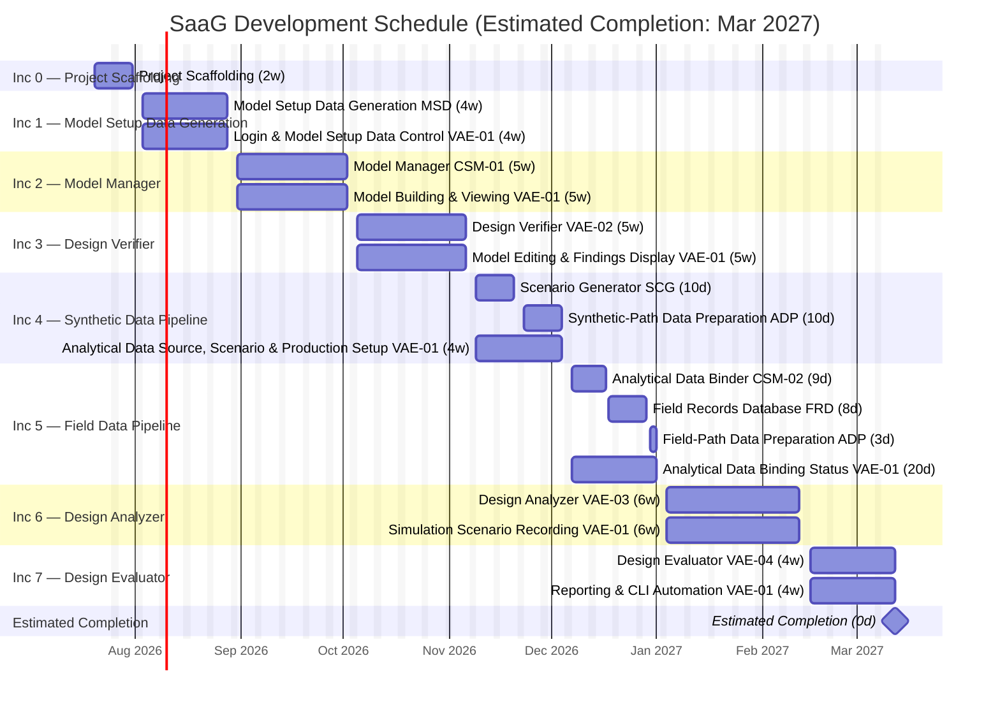

# Software Development Plan (SDP): System as a Graph (SaaG)

**Definition:** This Software Development Plan (SDP) is the plan for performing the software development of the System as a Graph (SaaG) Computer Software Configuration Item (CSCI). It decomposes the work defined in the SRS into a Work Breakdown Structure (WBS) of functional deliverables, and sequences those deliverables into a series of incremental builds. Every WBS deliverable and every increment is traceable to the CSU-scoped requirements in the SRS, which are themselves traceable to the SSS via its own Appendix A.

**Purpose:** The WBS (§1) establishes the full scope of development work, organized by Computer Software Component (CSC) and Computer Software Unit (CSU). The Incremental Development Plan (§2) sequences that work into a strictly serial series of builds — one increment at a time, in dependency-safe order. Each increment is scoped to one or more CSCs (their remaining CSUs) plus, where relevant, the corresponding slice of VAE-01 (Operations Panel), SaaG's front-door UI CSU, so that every increment produces an end-to-end, demonstrable capability.

---

## 1. Work Breakdown Structure

**Table 1. WBS Deliverable Distribution**

| No | Component | Abbreviation | CSUs | Deliverables |
|---|---|---|---|---|
| 1 | Model Setup Data Generation | SaaG-MSD | 1 | 1 |
| 2 | Scenario Generator | SaaG-SCG | 1 | 1 |
| 3 | Field Records Database | SaaG-FRD | 1 | 1 |
| 4 | Analytical Data Preparation | SaaG-ADP | 1 | 2 |
| 5 | Node-Relationship Based Core System Model | SaaG-CSM | 2 | 2 |
| 6 | Design Verification, Analysis and Evaluation | SaaG-VAE | 4 | 10 |
| **TOTAL** | | | **10** | **17** |

Each leaf bullet below cites the exact SRS requirement ID range it realizes.

- **SaaG**
  - **SaaG-MSD**
    - **MSD: Model Setup Data Generation** (MSD.1–23)
  - **SaaG-SCG**
    - **SCG: Scenario Generator** (SCG.1–7)
  - **SaaG-FRD**
    - **FRD: Field Records Database** (FRD.1–5)
  - **SaaG-ADP**
    - **ADP: Analytical Data Preparation**
      - Synthetic-Path Data Preparation (ADP.1, 3, 4, 6)
      - Field-Path Data Preparation (ADP.2, 5)
  - **SaaG-CSM**
    - **CSM-01: Model Manager** (CSM-01.1–31)
    - **CSM-02: Analytical Data Binder** (CSM-02.1–6)
  - **SaaG-VAE**
    - **VAE-01: Operations Panel**
      - Login & Model Setup Data Control (VAE-01.1–8)
      - Model Building & Viewing (VAE-01.9, 19–20)
      - Model Editing & Findings Display (VAE-01.17–18, 21–24)
      - Analytical Data Source, Scenario & Production Setup (VAE-01.10–15)
      - Analytical Data Binding Status (VAE-01.16)
      - Simulation Scenario Recording (VAE-01.25)
      - Reporting & CLI Automation (VAE-01.26–27)
    - **VAE-02: Design Verifier** (VAE-02.1–22)
    - **VAE-03: Design Analyzer** (VAE-03.1–21)
    - **VAE-04: Design Evaluator** (VAE-04.1–8)

---

## 2. Incremental Development Plan

Increment 0 establishes the repository scaffolding, shared cross-CSC infrastructure, and documentation skeleton that every subsequent increment builds on. The seven functional increments that follow are built one at a time, in dependency-safe order. Each increment delivers one or more CSCs' remaining CSUs plus the matching slice of VAE-01 (Operations Panel), which supports every other CSC and so appears across most increments rather than in one place. Each increment also states the explicit design, development, test, and packaging changes needed to deliver it, in addition to its demo scenario.

**Definition of Done (applies to every increment):** an increment is Done when (1) every deliverable in its CSU/Deliverable table is implemented and satisfies its cited SRS requirement(s); (2) every CDR item cited in its Design paragraph is Resolved, or explicitly Deferred past this increment with a recorded reason (per CDR's Status field); (3) everything called out in its Test paragraph passes — for requirement slices shared across increments, only the slice attributed to this increment must pass; (4) every service/container called out in its Packaging paragraph builds and deploys cleanly; (5) its Demo scenario has been executed end-to-end and observed successfully.

**Table 2. Increment Overview**

| # | Increment | CSUs delivered | CSCs complete |
|---|---|---|---|
| 0 | Project Scaffolding | — | — |
| 1 | Model Setup Data Generation | MSD | SaaG-MSD |
| 2 | Model Manager | CSM-01 | — |
| 3 | Design Verifier | VAE-02 | — |
| 4 | Synthetic Data Pipeline | SCG, ADP (synthetic slice) | SaaG-SCG |
| 5 | Field Data Pipeline | CSM-02, FRD, ADP (field slice) | SaaG-FRD, SaaG-ADP, SaaG-CSM |
| 6 | Design Analyzer | VAE-03 | — |
| 7 | Design Evaluator | VAE-04, VAE-01 (complete) | SaaG-VAE |

### Increment 0: Project Scaffolding

| CSU | Deliverable |
|---|---|
| — | Repository scaffolding, shared cross-CSC infrastructure, and documentation skeleton |

**Design:** No SRS requirements are implemented in this increment. It establishes the repository structure (§4), the hexagonal directory conventions every CSC follows, and the shared `contracts/`, `types/`, `errors/`, and `security/` primitives every later increment depends on.

**Development:** Scaffold the repository per §4 (per-CSC `src/`+`tests/` hexagonal layout, `web/`, `cli/`, `deploy/`), stand up the base Docker Compose stack (§5) with placeholder/health-check services, initialize the shared cross-CSC packages, and populate the `docs/` skeleton (`requirements/`, `planning/`, `design/`, `test/`) so every downstream document has a home.

**Test:** Verify the repository builds and lints cleanly, the base Docker Compose stack starts with placeholder services healthy, and CI runs successfully against the empty scaffolding.

**Packaging:** Stand up the base Docker Compose stack and CI pipeline — no application services yet.

**Demo:** A clean checkout of the repository builds, lints, and brings up its full Docker Compose stack end-to-end with no application logic, and every planning/requirements/design/test document has a placeholder in place under `docs/`.

**Definition of Done:**
- [ ] Repository scaffolded per §4 (per-CSC hexagonal layout, `web/`, `cli/`, `deploy/`, `shared/`)
- [ ] Base Docker Compose stack and CI pipeline stood up
- [ ] `docs/` skeleton populated for every planned document
- [ ] Scaffolding builds, lints, and deploys cleanly
- [ ] Demo run end-to-end

### Increment 1: Model Setup Data Generation

| CSU | Deliverable |
|---|---|
| MSD *(complete)* | Model Setup Data Generation (MSD.1–23) |
| VAE-01 *(ongoing)* | Login & Model Setup Data Control (VAE-01.1–8) |

**Completes:** SaaG-MSD

**Design:** MSD (SRS MSD.1–23) and the login/MSD-control screen (VAE-01.1–8) are fully designed. Still open: the exact protocol for each external connection and for LDAP, the topology method, and the required file list (CDR-09, CDR-10, CDR-17, CDR-18, CDR-19, CDR-20, CDR-22, CDR-24).

**Development:** Build the MSD backend — connect to, validate, and assemble data from the four external sources — plus login/session handling. On the frontend: login, project/platform/version selection, source configuration, and an MSD production/status screen.

**Test:** Verify MSD's five jobs (source connections, config pull, version tracking, file transfer, validation/assembly) and the login/production screens, then run an end-to-end MSD-file production.

**Packaging:** Stand up MSD and web services with a metadata database, a settings template for the four sources plus LDAP, and stand-in external systems for demoing.

**Demo:** An operator authenticates via LDAP, selects a project/platform/system version, configures and connects to all four external data sources, triggers Model Setup Data production end-to-end, and observes accessibility status and any errors, producing a valid, verified Model Setup Data file.

**Definition of Done:**
- [ ] MSD (MSD.1–23) and login/MSD-control (VAE-01.1–8) built and working
- [ ] CDR-09, CDR-10, CDR-17, CDR-18, CDR-19, CDR-20, CDR-22, CDR-24 resolved or deferred
- [ ] MSD and login/workflow tests pass
- [ ] MSD/web services deploy together
- [ ] Demo run end-to-end

### Increment 2: Model Manager

| CSU | Deliverable |
|---|---|
| CSM-01 *(complete)* | Model Manager (CSM-01.1–31) |
| VAE-01 *(ongoing)* | Model Building & Viewing (VAE-01.9, 19–20) |

**Design:** Model Manager (SRS CSM-01.1–31) and the model-build/browsing screen (VAE-01.9, 19–20) are fully designed. Biggest gap: the model's storage technology and schema aren't decided (CDR-29–30); concurrency limits and the VAE read protocol are also open (CDR-16, CDR-28).

**Development:** Build the Model Manager backend — turn Model Setup Data into a graph, keep it safe under concurrent access, support isolated evaluation copies — on a graph database. On the frontend: model browsing (search/filter/zoom/pan/attributes).

**Test:** Verify the model builds correctly, represents all node/relationship types, stays consistent under concurrent access, and browsing works — end-to-end, completing Increment 1's workflow test.

**Packaging:** Stand up the Model Manager service with a graph database and background-job handling for concurrency.

**Demo:** An operator builds the Core System Model from the Increment 1 Model Setup Data file, browses and visually navigates the resulting node-relationship structure (search/filter, zoom/pan, attribute display), while the model is served for concurrent multi-session access.

**Definition of Done:**
- [ ] Model Manager (CSM-01.1–31) and browsing screen (VAE-01.9,19–20) built and working
- [ ] CDR-16, CDR-28, CDR-29–30 resolved or deferred
- [ ] Model Manager and browsing tests pass, completing Increment 1's
- [ ] Model Manager service and graph database deploy together
- [ ] Demo run end-to-end

### Increment 3: Design Verifier

| CSU | Deliverable |
|---|---|
| VAE-02 *(complete)* | Design Verifier (VAE-02.1–22) |
| VAE-01 *(ongoing)* | Model Editing & Findings Display (VAE-01.17–18, 21–24) |

**Design:** Design Verifier (SRS VAE-02.1–22) and the model-editor/findings screen (VAE-01.17–18, 21–24) are laid out, but most of the actual pass/fail rules are undecided — the biggest design gap in this plan (CDR-01–08).

**Development:** Build the Design Verifier's six checking engines against interim rules until CDR-01–08 close. On the frontend: the working-model editor (safe sandbox) and findings display/classification.

**Test:** Verify all six engines catch their fault conditions, editor changes never touch the real model, and findings display correctly — though some checks can only verify mechanics, not thresholds, until the rules close. End-to-end: edit and verify.

**Packaging:** Stand up the Design Verifier service — no new storage; it reads the model and writes findings to Increment 1's database.

**Demo:** An operator edits a working-model sandbox derived from the Core System Model (add/remove nodes/relationships, update attributes) and runs design verification against it — QoS conformance, publisher/consumer matching, resource/load-balancing checks, circular-dependency and architectural-rule detection — with findings presented, classified, and filterable.

**Definition of Done:**
- [ ] Design Verifier (VAE-02.1–22) and editor/findings screen (VAE-01.17–18,21–24) built and working
- [ ] CDR-01–08 — the biggest open item in this plan — resolved or deferred
- [ ] Verifier and editor/findings tests pass (to the extent rules allow)
- [ ] Design Verifier service deploys and runs
- [ ] Demo run end-to-end

### Increment 4: Synthetic Data Pipeline

| CSU | Deliverable |
|---|---|
| SCG *(complete)* | Scenario Generator (SCG.1–7) |
| ADP *(ongoing)* | Synthetic-Path Data Preparation (ADP.1, 3, 4, 6) |
| VAE-01 *(ongoing)* | Analytical Data Source, Scenario & Production Setup (VAE-01.10–15) |

**Completes:** SaaG-SCG

**Design:** Scenario Generator (SRS SCG.1–7) and the synthetic-data setup screen (VAE-01.10–15) are fully designed. Still open: what the synthetic data should simulate, the Analytical Evaluation Data format, and the SCG→ADP handoff (CDR-11, CDR-12, CDR-25).

**Development:** Build the Scenario Generator (capture inputs, produce and record traceable synthetic data) and the synthetic-intake half of Analytical Data Preparation. On the frontend: scenario input and production/status screens.

**Test:** Verify scenario inputs are captured, synthetic data matches the real system's structure, and the synthetic intake/assembly works — end-to-end, generating synthetic data and preparing analytical data.

**Packaging:** Stand up the Scenario Generator and Analytical Data Preparation services — no new storage; data streams straight through.

**Demo:** An operator defines scenario scope/type/interval/density/data types, triggers synthetic data production, and observes the produced data recorded and traceable to its inputs. The synthetic data is then prepared into Analytical Evaluation Data (AED), with production status tracked and any format/missing-field errors reported — completing SaaG-SCG.

**Definition of Done:**
- [ ] Scenario Generator (SCG.1–7) and setup screen (VAE-01.10–15) built and working
- [ ] CDR-11, CDR-12, CDR-25 resolved or deferred
- [ ] Scenario Generator and synthetic-path tests pass
- [ ] Both services deploy together
- [ ] Demo run end-to-end

### Increment 5: Field Data Pipeline

| CSU | Deliverable |
|---|---|
| CSM-02 *(complete)* | Analytical Data Binder (CSM-02.1–6) |
| FRD *(complete)* | Field Records Database (FRD.1–5) |
| ADP *(complete)* | Field-Path Data Preparation (ADP.2, 5) |
| VAE-01 *(ongoing)* | Analytical Data Binding Status (VAE-01.16) |

**Completes:** SaaG-FRD, SaaG-ADP, SaaG-CSM

**Design:** Analytical Data Binder (SRS CSM-02.1–6) and Field Records Database (FRD.1–5) are fully designed, as is the binding-status screen (VAE-01.16). Still open: field-record storage capacity, the FRD external interface protocol, the FRD→ADP and ADP→CSM-02 handoffs, and the carried-over AED format decision (CDR-15, CDR-21, CDR-26, CDR-27, CDR-12).

**Development:** Build the Field Records Database (upload/catalog/search), the field-intake half of Analytical Data Preparation, and the Data Binder (attach behavioral data without altering the model). On the frontend: field-record upload/catalog and binding-status screens.

**Test:** Verify records upload/catalog correctly, the field intake/assembly completes (never mixing with synthetic data), and binding matches data to the model without changing it — end-to-end, including a check that Increment 2's model is untouched.

**Packaging:** Stand up the Field Records Database and Data Binder services with a time-series database for telemetry; raw uploads are discarded after parsing.

**Demo:** The synthetic-sourced AED from Increment 4 is bound onto the Core System Model without altering its nodes/relationships, with binding status and provenance visible to the operator. The operator then uploads System Field Records (listing/searching/selecting them by project, platform, version, source, or upload time), and the resulting field-sourced AED is bound onto the model via the same source-agnostic binder — completing SaaG-FRD, SaaG-ADP (both the synthetic and field paths now work end-to-end), and SaaG-CSM.

**Definition of Done:**
- [ ] Data Binder (CSM-02.1–6), FRD (FRD.1–5), and binding-status screen (VAE-01.16) built and working
- [ ] CDR-15, CDR-21, CDR-26, CDR-27, CDR-12 resolved or deferred
- [ ] Field-records, binder, and field-path tests pass, completing Increment 4's
- [ ] New services and telemetry database deploy together
- [ ] Demo run end-to-end

### Increment 6: Design Analyzer

| CSU | Deliverable |
|---|---|
| VAE-03 *(complete)* | Design Analyzer (VAE-03.1–21) |
| VAE-01 *(ongoing)* | Simulation Scenario Recording (VAE-01.25) |

**Design:** Design Analyzer (SRS VAE-03.1–21) and the simulation-recording screen (VAE-01.25) are fully designed. No item names it directly, but it depends on two carried-over decisions: the VAE read protocol and the model's storage/schema (CDR-28, CDR-29–30).

**Development:** Build the Design Analyzer's three engines (synthetic-data simulation, field-data analysis, drift detection). On the frontend: simulation-scenario recording and high-volume field-trace charts.

**Test:** Verify all three engines produce correct results for their data sources and fault scenarios, and simulation metadata is recorded — end-to-end analysis-and-record run.

**Packaging:** Stand up the Design Analyzer service — no new storage; it reads Increment 2 and 5's databases.

**Demo:** An operator runs static analysis using synthetic-sourced AED (message/traffic flow, node/relationship-inactivity effects, load-density and fault-propagation analysis, resource-usage summaries) and using field-record-sourced AED (operational/health status, resource usage, error/timeout information, communication latency/loss, model-vs-runtime drift detection), with simulation scenario metadata (VAE-01.25) recorded against the results.

**Definition of Done:**
- [ ] Design Analyzer (VAE-03.1–21) and recording screen (VAE-01.25) built and working
- [ ] Carried-over CDR-28, CDR-29–30 resolved or deferred
- [ ] Design Analyzer tests pass
- [ ] Design Analyzer service deploys and runs
- [ ] Demo run end-to-end

### Increment 7: Design Evaluator

| CSU | Deliverable |
|---|---|
| VAE-04 *(complete)* | Design Evaluator (VAE-04.1–8) |
| VAE-01 *(complete)* | Reporting & CLI Automation (VAE-01.26–27) |

**Completes:** SaaG-VAE

**Design:** Design Evaluator (SRS VAE-04.1–8) and the reporting/CLI screen (VAE-01.26–27) are fully designed. Still open: the scoring method, report file format, and CLI protocol/result format (CDR-13, CDR-14, CDR-23) — all should close before this final increment ships.

**Development:** Build the Design Evaluator (score candidates, force non-conforming on critical findings, run evaluations concurrently) and the CLI. Add PDF/JSON report generation and the report screen.

**Test:** Verify scoring, the forced non-conforming rule, concurrent evaluation, and CLI request/status — end-to-end CLI evaluation through decision and report, closing out every component.

**Packaging:** Stand up the Design Evaluator service, CLI package, and background-worker support with PDF generation — bringing every increment's services online together.

**Demo:** An automation client (e.g., Jenkins) submits an installation-suitability evaluation via CLI for one or more candidate software units; the system scores each unit against its evaluation headings and control rules, returns a blocking/non-blocking decision and machine-processable results concurrently and independently per unit, and a comprehensive summary/detailed report covering all verification, analysis, and evaluation results is generated — completing SaaG-VAE and all six CSCs.

**Definition of Done:**
- [ ] Design Evaluator (VAE-04.1–8) and reporting/CLI screen (VAE-01.26–27) built and working
- [ ] CDR-13, CDR-14, CDR-23 resolved or deferred
- [ ] Evaluator and CLI tests pass, completing the reporting test from Increments 3/6/7
- [ ] Full service stack deploys together
- [ ] Demo run end-to-end — all six components complete

---

## 3. Development Schedule

**Estimated completion: 2027-03-12.** Per §2, Increment 0 plus the seven functional increments are built strictly serially in dependency-safe order, starting **2026-07-20**. Each functional increment is a 3–6 week, demoable, end-to-end slice with backend and Operations Panel UI work running concurrently. One week = 5 business days (weekends excluded).

**Table 3. Increment Schedule Summary**

| Increment | Start | End | Duration |
|---|---|---|---|
| 0 — Project Scaffolding | 2026-07-20 | 2026-07-31 | 2w |
| 1 — Model Setup Data Generation | 2026-08-03 | 2026-08-28 | 4w |
| 2 — Model Manager | 2026-08-31 | 2026-10-02 | 5w |
| 3 — Design Verifier | 2026-10-05 | 2026-11-06 | 5w |
| 4 — Synthetic Data Pipeline | 2026-11-09 | 2026-12-04 | 4w |
| 5 — Field Data Pipeline | 2026-12-07 | 2027-01-01 | 4w |
| 6 — Design Analyzer | 2027-01-04 | 2027-02-12 | 6w |
| 7 — Design Evaluator | 2027-02-15 | 2027-03-12 | 4w |

**Figure 1. SaaG Development Schedule**



---

## 4. Project Structure

The implementation shall use a shallow repository structure where every top-level backend directory maps to exactly one CSC. The `web/` and `cli/` directories implement the VAE-01 user-facing applications. Each CSC owns its own hexagonal boundary: inbound adapters, application use cases, domain model, outbound ports, and outbound adapters.

```text
system-as-a-graph/
├── README.md
├── docs/
│   ├── requirements/
│   │   ├── SSS.md
│   │   └── SRS.md
│   ├── planning/
│   │   └── SDP.md
│   ├── design/
│   │   ├── SDD.md
│   │   ├── UXD.md
│   │   └── CDR.md
│   └── test/
│       └── STD.md
│
├── web/                               # VAE-01 web application
├── cli/                               # VAE-01 command-line application
│
├── msd/                               # CSC-1: Model Setup Data Generation
│   ├── src/
│   │   ├── api/
│   │   ├── use_cases/
│   │   ├── model/
│   │   ├── ports/
│   │   └── adapters/
│   └── tests/
│
├── scg/                               # CSC-2: Scenario Generator
│   ├── src/
│   │   ├── api/
│   │   ├── use_cases/
│   │   ├── model/
│   │   ├── ports/
│   │   └── adapters/
│   └── tests/
│
├── frd/                               # CSC-3: Field Records Database
│   ├── src/
│   │   ├── api/
│   │   ├── use_cases/
│   │   ├── model/
│   │   ├── ports/
│   │   └── adapters/
│   └── tests/
│
├── adp/                               # CSC-4: Analytical Data Preparation
│   ├── src/
│   │   ├── api/
│   │   ├── use_cases/
│   │   ├── model/
│   │   ├── ports/
│   │   └── adapters/
│   └── tests/
│
├── csm/                               # CSC-5: Core System Model
│   ├── src/
│   │   ├── model_manager/             # CSM-01
│   │   │   ├── api/
│   │   │   ├── use_cases/
│   │   │   ├── model/
│   │   │   ├── ports/
│   │   │   └── adapters/
│   │   └── data_binder/               # CSM-02
│   │       ├── api/
│   │       ├── use_cases/
│   │       ├── model/
│   │       ├── ports/
│   │       └── adapters/
│   └── tests/
│
├── vae/                               # CSC-6: Verification, Analysis, Evaluation
│   ├── src/
│   │   ├── design_verifier/           # VAE-02
│   │   │   ├── api/
│   │   │   ├── use_cases/
│   │   │   ├── model/
│   │   │   ├── ports/
│   │   │   └── adapters/
│   │   ├── design_analyzer/           # VAE-03
│   │   │   ├── api/
│   │   │   ├── use_cases/
│   │   │   ├── model/
│   │   │   ├── ports/
│   │   │   └── adapters/
│   │   └── design_evaluator/          # VAE-04
│   │       ├── api/
│   │       ├── use_cases/
│   │       ├── model/
│   │       ├── ports/
│   │       └── adapters/
│   └── tests/
│
├── shared/
│   ├── contracts/
│   ├── types/
│   ├── errors/
│   └── security/
│
├── tests/
│   ├── integration/
│   └── acceptance/
│
└── deploy/
    ├── docker/
    └── environments/
```

**Table 4. Project Directory Mapping**

| Directory | Scope |
|---|---|
| `web/` | VAE-01 web application for operators |
| `cli/` | VAE-01 command-line application for automation clients |
| `msd/` | SaaG-MSD CSC; contains `MSD` |
| `scg/` | SaaG-SCG CSC; contains `SCG` |
| `frd/` | SaaG-FRD CSC; contains `FRD` |
| `adp/` | SaaG-ADP CSC; contains `ADP` |
| `csm/` | SaaG-CSM CSC; contains `CSM-01` and `CSM-02` |
| `vae/` | SaaG-VAE backend CSC; contains `VAE-02`, `VAE-03`, and `VAE-04` |
| `shared/contracts/` | Cross-CSC request, response, event, and file schemas |
| `shared/types/` | Cross-CSC value objects and primitive shared types |
| `shared/errors/` | Cross-CSC error base classes and common error types |
| `shared/security/` | Cross-CSC authentication and authorization helpers |
| `tests/integration/` | Cross-CSC and adapter integration tests |
| `tests/acceptance/` | End-to-end requirement and increment demonstration tests |
| `deploy/` | Docker deployment descriptors and environment-specific configuration |

**Table 5. Standard Hexagonal Directory Meaning**

| Directory | Meaning |
|---|---|
| `api/` | Inbound adapters: REST endpoints, CLI handlers, or message handlers that call CSU use cases |
| `use_cases/` | Application core: CSU workflows that implement SRS requirements |
| `model/` | Domain core: business objects, rules, and calculations owned by the CSU |
| `ports/` | Outbound ports: interfaces required by use cases for databases, files, queues, or external systems |
| `adapters/` | Outbound adapters: implementations of `ports/`, such as PostgreSQL, FalkorDB, LDAP, Git, REST, or file adapters |

---

## 5. Technology Stack

The technology choices below implement the WBS deliverables (§1) and are traceable to the same SRS requirement IDs used throughout this document.

**Table 6. Technology Stack Summary**

| Area | Technology | Usage |
|---|---|---|
| **Backend & API** | | |
| Backend language/runtime | Python (FastAPI) | Backend services (MSD/SCG/FRD/ADP/CSM/VAE) |
| API style | REST (JSON over HTTP) | Operations Panel and CLI/Jenkins integration (VAE-01.27) |
| CLI framework | Python (Click/Typer) | Automation-client interface (VAE-01.27) |
| **Data Storage** | | |
| Graph storage | FalkorDB | Core System Model with isolated model sets (CSM-01) |
| Relational storage | PostgreSQL | Structured metadata and VAE operations/findings records (MSD, FRD, VAE-01.23, VAE-01.25, VAE-01.26, VAE-02/03/04, VAE-04.8) |
| Time-series storage | VictoriaMetrics | Field-record telemetry (FRD.1, VAE-03.12–13,15) |
| **Frontend & UI** | | |
| Frontend framework | Next.js ^14.2 (React ^18.3) | Operations Panel (VAE-01) |
| Graph visualization | React Flow ^12.11 | Model browsing, search/filter, and non-destructive structural editing (VAE-01.17, VAE-01.19–20) |
| Charting / analytics visualization | Recharts ^3.9 + shadcn/ui Chart + ECharts ^6.1 | Findings, status, and KPI charts, plus high-volume field-trace charts (VAE-01.23, VAE-01.26, VAE-02/03/04) |
| UI component library | Refine ^5.0 + shadcn/ui (Radix UI) + Tailwind CSS ~3.4 | Login, CRUD/editing, findings, and report screens; LDAP-aware access-control provider (VAE-01, VAE-01.3) |
| Data/table/form layer | TanStack Query ^5.101 + TanStack Table ^8.21 + React Hook Form ^7.81 | Server-state caching, findings/report table state, and editing/login form state under Refine's hooks (VAE-01.17,21–23,26) |
| **Security & Authentication** | | |
| Authentication | LDAP direct bind (python-ldap/ldap3) | Operator authentication (VAE-01.3) |
| Session/token strategy | JWT (stateless) | REST session across UI and CLI (VAE-01.3) |
| Secrets management | Environment variables (.env) | LDAP/DB/JWT credential storage |
| **Infrastructure & Deployment** | | |
| Containerization | Docker Compose | Single-team deployment with no orchestration overhead |
| Deployment target | On-premises / private data center | LDAP and config-mgmt DB integration |
| **Background Processing & Status** | | |
| Background task execution | Procrastinate (PostgreSQL) | Long-running/concurrent operations with status, retries, chaining, and isolation (VAE-01.27, VAE-04.7, CSM-01.30, VAE-04.8) |
| Status delivery | SSE (UI) + REST polling (CLI) | Operation status delivery (VAE-01.15/16/27) |
| **External Integrations** | | |
| External-integration architecture | Ports and Adapters (Hexagonal) | Real adapters in production; fake adapters in development, DI-selected |
| Source code repository adapter | Git over HTTPS (token auth) | Source code, scripts, and config files (MSD.3, 17–20) |
| Package repository adapter | REST API (Artifactory/Nexus-style) | System Software Units Package Repository (MSD.4) |
| Configuration management DB adapter | Generic SQL adapter (SQLAlchemy) | External configuration management database (MSD.2, 8, 10–13) |
| **Reporting & Data Handling** | | |
| Report generation | PDF (WeasyPrint/ReportLab) + JSON | Summary/detailed reports; JSON shared with evaluator (VAE-01.26, VAE-04.8) |
| Raw upload retention | Discard after parsing | Minimum storage footprint (FRD.2) |
| **Testing** | | |
| Testing | pytest (backend) + Playwright (frontend/E2E) | Unit and full E2E coverage |

