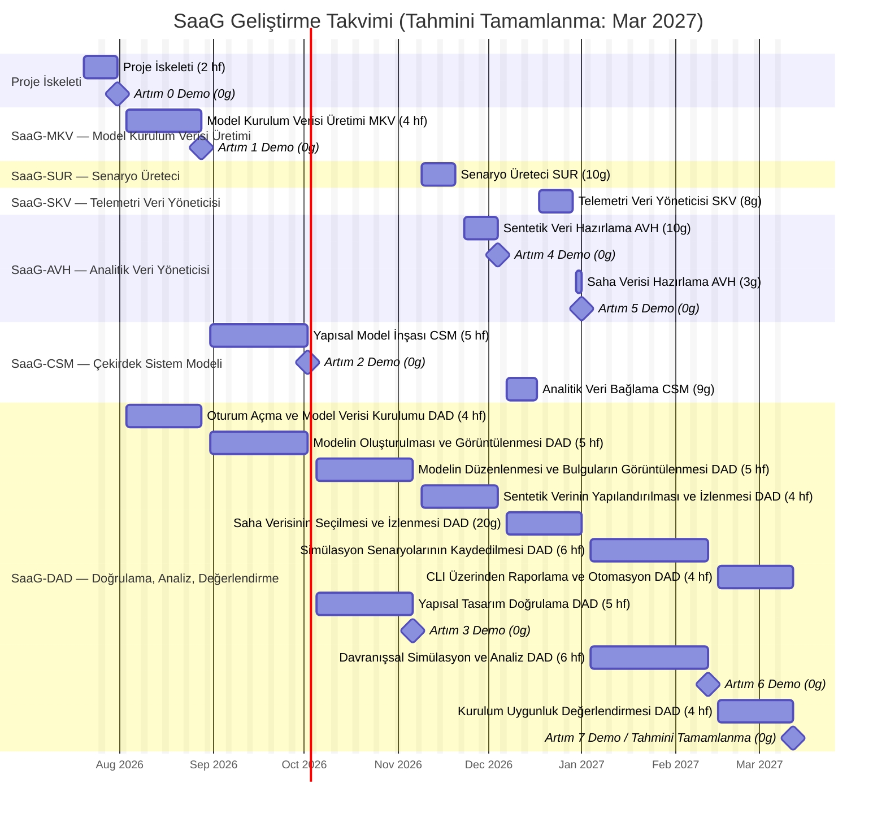

# Yazılım Geliştirme Planı (SDP): System as a Graph (SaaG)

**Tanım:** Bu Yazılım Geliştirme Planı (SDP), System as a Graph (SaaG) Yazılım Kırılım Öğesinin (CSCI) yazılım geliştirme çalışmasının nasıl yürütüleceğini planlar. SRS'te tanımlanan işi, işlevsel teslimatlardan oluşan bir İş Kırılım Yapısına (WBS) ayrıştırır ve bu teslimatları bir dizi artımlı yapıya (increment) sıralar. Her WBS teslimatı ve her artım, temel sistem kabiliyetlerini §7 üzerinden dağıtan SRS'in CSU kapsamlı isterlerine izlenebilir durumdadır.

**Amaç:** İş Kırılım Yapısı (§1), Yazılım Komponenti (CSC) ve Yazılım Birimi (CSU) bazında organize edilmiş şekilde geliştirme çalışmasının tam kapsamını ortaya koyar. Artımlı Geliştirme Planı (§2), bu çalışmayı — bağımlılık açısından güvenli bir sırayla, tek seferde bir artım olacak şekilde — tamamen ardışık bir yapı dizisine sıralar. Her artım; bir veya daha fazla CSC'nin/CSU'nun yanı sıra, ilgili olduğu ölçüde DAD'nin (Operasyonlar ve Görselleştirme, SaaG'ın ön yüz kullanıcı arayüzü bileşeni) karşılık gelen dilimini de kapsayacak şekilde belirlenmiştir; böylece her artım uçtan uca, gösterilebilir bir yetenek üretir.

---

## 1. İş Kırılım Yapısı (WBS)

**Tablo 1. WBS Teslimat Dağılımı**

| No | Bileşen | Kısaltma | CSU Sayısı | Teslimat Sayısı |
|---|---|---|---|---|
| 1 | Model Kurulum Üreteci | SaaG-MKV | 1 | 1 |
| 2 | Senaryo Üreteci | SaaG-SUR | 1 | 1 |
| 3 | Telemetri Veri Yöneticisi | SaaG-SKV | 1 | 1 |
| 4 | Analitik Veri Yöneticisi | SaaG-AVH | 1 | 2 |
| 5 | Çekirdek Sistem Modeli | SaaG-CSM | 1 | 2 |
| 6 | Tasarım Doğrulama Motoru | SaaG-DAD | 1 | 10 |
| **TOPLAM** | | | **6** | **17** |

Each leaf bullet below cites the exact SRS requirement ID range it realizes.

- **SaaG**
  - **SaaG-MKV**
    - **MKV: Model Kurulum Üreteci** (MKV.1–23)
  - **SaaG-SUR**
    - **SUR: Senaryo Üreteci** (SUR.1–7)
  - **SaaG-SKV**
    - **SKV: Telemetri Veri Yöneticisi** (SKV.1–5)
  - **SaaG-AVH**
    - **AVH: Analitik Veri Yöneticisi**
      - Sentetik Veri Hazırlama (AVH.1, 3, 4, 6)
      - Saha Verisi Hazırlama (AVH.2, 5)
  - **SaaG-CSM**
    - **CSM: Çekirdek Sistem Modeli**
      - Yapısal Model İnşası (CSM.1–31)
      - Analitik Veri Bağlama (CSM.32–37)
  - **SaaG-DAD**
    - **DAD: Tasarım Doğrulama Motoru**
      - Operasyonlar ve Görselleştirme (DAD.1–27)
        - Oturum Açma ve Model Verisi Kurulumu (DAD.1–8)
        - Modelin Oluşturulması ve Görüntülenmesi (DAD.9, 19–20)
        - Modelin Düzenlenmesi ve Bulguların Görüntülenmesi (DAD.17–18, 21–24)
        - Sentetik Verinin Yapılandırılması ve İzlenmesi (DAD.11, 13–15)
        - Saha Verisinin Seçilmesi ve İzlenmesi (DAD.10, 12, 16)
        - Simülasyon Senaryolarının Kaydedilmesi (DAD.25)
        - CLI Üzerinden Raporlama ve Otomasyon (DAD.26–27)
      - Yapısal Tasarım Doğrulama (DAD.28–49)
      - Davranışsal Simülasyon ve Analiz (DAD.50–70)
      - Kurulum Uygunluk Değerlendirmesi (DAD.71–78)

---

## 2. Artımlı Geliştirme Planı

Artım 0, depo iskeletini, paylaşılan altyapıyı ve dokümantasyon iskeletini kurar. Bunu izleyen yedi işlevsel artım, bağımlılık açısından güvenli bir sırayla, tek seferde bir tanesi olacak şekilde inşa edilir. Her artım, bir veya daha fazla CSC'nin kalan CSU'larını ve bunlara karşılık gelen DAD (Operasyonlar ve Görselleştirme) dilimini teslim eder. Her artım ayrıca, teslimatı için gereken tasarım, geliştirme, test ve paketleme çalışmasını ve demo senaryosunu belirtir. SDD, UXD, CDR ve STD, her artımın kendi CSU'larını kapsayacak şekilde her artım içinde güncellenir.

**Tamamlanma Tanımı (DoD — her artım için geçerlidir):** Bir artım şu durumda Tamamlanmış sayılır: (1) CSU/Teslimat tablosundaki her teslimat gerçekleştirilmiş ve ilgili SRS isterini/isterlerini karşılıyor; (2) Tasarım paragrafında atıfta bulunulan her CDR maddesi, gerekçesi kayıt altına alınmış şekilde Çözümlenmiş veya Ertelenmiş durumda; (3) Test paragrafındaki her şey geçiyor; (4) Paketleme paragrafındaki her servis temiz şekilde derleniyor ve dağıtılıyor; (5) Demo senaryosu uçtan uca çalışıyor.

**Tablo 2. Artım Genel Görünümü**

| # | Artım | Teslim Edilen CSU'lar | Tamamlanan CSC'ler |
|---|---|---|---|
| 0 | Proje İskeleti | — | — |
| 1 | Model Kurulum Verisi Üretimi | MKV | SaaG-MKV |
| 2 | Yapısal Model İnşası | CSM (yapısal dilim) | — |
| 3 | Yapısal Tasarım Doğrulama | DAD (doğrulama dilimi) | — |
| 4 | Sentetik Veri Hattı | SUR, AVH (sentetik dilim) | SaaG-SUR |
| 5 | Saha Verisi Hattı | CSM (bağlama dilimi), SKV, AVH (saha dilimi) | SaaG-SKV, SaaG-AVH, SaaG-CSM |
| 6 | Davranışsal Tasarım Analizi | DAD (analiz dilimi) | — |
| 7 | Kurulum Uygunluk Değerlendirmesi | DAD (değerlendirme ve operasyonlar tamamlandı) | SaaG-DAD |

### Artım 0: Proje İskeleti

| CSU | Teslimat |
|---|---|
| — | Depo iskeleti, CSC'ler arası paylaşılan altyapı ve dokümantasyon iskeleti |

**Tasarım:** Herhangi bir SRS isteri gerçekleştirilmez. Depo yapısını (§4), altıgen dizin kurallarını ve sonraki her artımın bağımlı olduğu paylaşılan CSC'ler arası ilkel bileşenleri kurar.

**Geliştirme:** Depo, §4'e göre iskeletlendirilir; yer tutucu servislerle temel Docker Compose yığını ayağa kaldırılır; paylaşılan paketler başlatılır ve `docs/` iskeleti doldurulur.

**Test:** Deponun temiz şekilde derlendiği ve lint kontrolünden geçtiği, yer tutucu servislerin sağlıklı başladığı ve CI'ın boş iskelet üzerinde başarıyla çalıştığı doğrulanır.

**Paketleme:** Temel Docker Compose yığını ve CI hattı ayağa kaldırılır — henüz uygulama servisi yoktur.

**Demo:** Temiz bir checkout, herhangi bir uygulama mantığı olmadan derlenir, lint kontrolünden geçer ve tam Docker Compose yığınını ayağa kaldırır; planlanan her doküman için `docs/` altında bir yer tutucu bulunur.

**Tamamlanma Tanımı:**
- [x] Depo §4'e göre iskeletlendirildi (CSC başına altıgen yerleşim, `web/`, `cli/`, `shared/`)
- [x] Temel Docker Compose yığını ve CI hattı ayağa kaldırıldı
- [x] `docs/` iskeleti planlanan her doküman için dolduruldu
- [x] İskelet temiz şekilde derleniyor, lint kontrolünden geçiyor ve dağıtılıyor
- [x] Demo uçtan uca çalıştırıldı

### Artım 1: Model Kurulum Verisi Üretimi

| CSU | Teslimat |
|---|---|
| MKV *(tamamlandı)* | Model Kurulum Verisi Üretimi (MKV.1–23) |
| DAD *(devam ediyor)* | Oturum Açma ve Model Verisi Kurulumu (DAD.1–8) |

**Tamamlar:** SaaG-MKV

**Tasarım:** MKV (SRS MKV.1–23) ve oturum açma/MKV kontrol ekranı (DAD.1–8) tam olarak tasarlanmıştır. Hâlâ açık olan konular: her dış bağlantı ve LDAP için kesin protokol, topoloji alım yöntemi ve zorunlu dosya listesi (CDR-09, CDR-10, CDR-17, CDR-18, CDR-19, CDR-20, CDR-22, CDR-24).

**Geliştirme:** MKV arka ucu inşa edilir — dört dış kaynaktan veriye bağlanma, doğrulama ve derleme — ayrıca oturum açma/oturum yönetimi eklenir. Ön yüzde: oturum açma, proje/platform/sürüm seçimi, kaynak yapılandırması ve bir MKV üretim/durum ekranı.

**Test:** MKV'nin beş işi (kaynak bağlantıları, konfigürasyon alımı, sürüm takibi, dosya aktarımı, doğrulama/derleme) ile oturum açma/üretim ekranları doğrulanır; ardından uçtan uca bir MKV dosyası üretimi çalıştırılır.

**Paketleme:** MKV ve web servisleri; bir metadata veritabanı, dört kaynak ile LDAP için bir ayar şablonu ve demo amaçlı yerine geçen (stand-in) dış sistemlerle birlikte ayağa kaldırılır.

**Demo:** Bir operatör LDAP üzerinden kimlik doğrular, bir proje/platform/sistem sürümü seçer, dört dış veri kaynağının tamamını yapılandırır ve bunlara bağlanır, Model Kurulum Verisi üretimini uçtan uca tetikler ve erişilebilirlik durumunu ve olası hataları gözlemler; sonuçta geçerli ve doğrulanmış bir Model Kurulum Verisi dosyası üretilir.

**Tamamlanma Tanımı:**
- [ ] MKV (MKV.1–23) ve oturum açma/MKV kontrolü (DAD.1–8) inşa edildi ve çalışıyor
- [ ] CDR-09, CDR-10, CDR-17, CDR-18, CDR-19, CDR-20, CDR-22, CDR-24 çözümlendi veya ertelendi
- [ ] MKV ve oturum açma/iş akışı testleri geçiyor
- [ ] MKV/web servisleri birlikte dağıtılıyor
- [ ] Demo uçtan uca çalıştırıldı

### Artım 2: Yapısal Model İnşası

| CSU | Teslimat |
|---|---|
| CSM *(devam ediyor)* | Yapısal Model İnşası (CSM.1–31) |
| DAD *(devam ediyor)* | Modelin Oluşturulması ve Görüntülenmesi (DAD.9, 19–20) |

**Tasarım:** Çekirdek Sistem Modeli (SRS CSM.1–31) ve model inşa/gezinme ekranı (DAD.9, 19–20) tam olarak tasarlanmıştır. En büyük açık: modelin depolama teknolojisi ve şeması henüz kararlaştırılmamıştır (CDR-29–30); eşzamanlılık sınırları ve DAD okuma protokolü de açıktır (CDR-16, CDR-28).

**Geliştirme:** Model Yöneticisi arka ucu bir graf veritabanı üzerinde inşa edilir — Model Kurulum Verisini bir grafa dönüştürme, eşzamanlı erişim altında güvende tutma, izole değerlendirme kopyalarını destekleme. Ön yüzde: model gezinme (arama/süzme/yakınlaştırma/kaydırma/öznitelikler).

**Test:** Modelin doğru şekilde inşa edildiği, tüm düğüm/ilişki türlerini temsil ettiği, eşzamanlı erişim altında tutarlı kaldığı ve gezinmenin çalıştığı doğrulanır — Artım 1'in iş akışı testini tamamlayacak şekilde uçtan uca.

**Paketleme:** Model Yöneticisi servisi; bir graf veritabanı ve eşzamanlılık için arka plan iş (background-job) yönetimiyle birlikte ayağa kaldırılır.

**Demo:** Bir operatör, Artım 1'deki Model Kurulum Verisi dosyasından Çekirdek Sistem Modelini inşa eder; ortaya çıkan düğüm-ilişki yapısında gezinir ve görsel olarak dolaşır (arama/süzme, yakınlaştırma/kaydırma, öznitelik gösterimi); bu sırada model, eşzamanlı çoklu oturum erişimine açık şekilde sunulur.

**Tamamlanma Tanımı:**
- [ ] Çekirdek Sistem Modeli (CSM.1–31) ve gezinme ekranı (DAD.9, 19–20) inşa edildi ve çalışıyor
- [ ] CDR-16, CDR-28, CDR-29–30 çözümlendi veya ertelendi
- [ ] Model Yöneticisi ve gezinme testleri, Artım 1'inkini tamamlayacak şekilde geçiyor
- [ ] Model Yöneticisi servisi ve graf veritabanı birlikte dağıtılıyor
- [ ] Demo uçtan uca çalıştırıldı

### Artım 3: Yapısal Tasarım Doğrulama

| CSU | Teslimat |
|---|---|
| DAD *(devam ediyor)* | Yapısal Tasarım Doğrulama (DAD.28–49) |
| DAD *(devam ediyor)* | Modelin Düzenlenmesi ve Bulguların Görüntülenmesi (DAD.17–18, 21–24) |

**Tasarım:** Yapısal Tasarım Doğrulama (SRS DAD.28–49) ve model düzenleyici/bulgu ekranı (DAD.17–18, 21–24) taslak olarak ortaya konmuştur; ancak fiili geçti/kaldı kurallarının çoğu henüz kararlaştırılmamıştır — bu planın en büyük tasarım açığı (CDR-01–08).

**Geliştirme:** Tasarım Doğrulayıcının altı kontrol motoru, CDR-01–08 kapanana kadar geçici kurallara göre inşa edilir. Ön yüzde: çalışma modeli düzenleyicisi (güvenli sandbox) ve bulgu gösterimi/sınıflandırması.

**Test:** Altı motorun tamamının kendi hata koşullarını yakaladığı, düzenleyicideki değişikliklerin gerçek modele hiçbir zaman dokunmadığı ve bulguların doğru şekilde gösterildiği doğrulanır — bazı kontroller, kurallar kapanana kadar yalnızca mekaniği doğrulayabilir, eşik değerlerini değil. Uçtan uca: düzenle ve doğrula.

**Paketleme:** Tasarım Doğrulayıcı servisi ayağa kaldırılır — yeni bir depolama yoktur; modeli okur ve bulguları Artım 1'in veritabanına yazar.

**Demo:** Bir operatör, Çekirdek Sistem Modelinden türetilen bir çalışma modeli sandbox'ını düzenler (düğüm/ilişki ekleme-çıkarma, öznitelik güncelleme) ve buna karşı tasarım doğrulama çalıştırır — QoS uygunluğu, yayımlayıcı/tüketici eşleşmesi, kaynak/yük dengeleme kontrolleri, döngüsel bağımlılık ve mimari kural ihlali tespiti — bulgular sunulur, sınıflandırılır ve süzülebilir hâlde gösterilir.

**Tamamlanma Tanımı:**
- [ ] Yapısal Tasarım Doğrulama (DAD.28–49) ve düzenleyici/bulgu ekranı (DAD.17–18, 21–24) inşa edildi ve çalışıyor
- [ ] CDR-01–08 — bu plandaki en büyük açık madde — çözümlendi veya ertelendi
- [ ] Doğrulayıcı ve düzenleyici/bulgu testleri (kuralların izin verdiği ölçüde) geçiyor
- [ ] Tasarım Doğrulayıcı servisi dağıtılıyor ve çalışıyor
- [ ] Demo uçtan uca çalıştırıldı

### Artım 4: Sentetik Veri Hattı

| CSU | Teslimat |
|---|---|
| SUR *(tamamlandı)* | Senaryo Üreteci (SUR.1–7) |
| AVH *(devam ediyor)* | Sentetik Veri Hazırlama (AVH.1, 3, 4, 6) |
| DAD *(devam ediyor)* | Sentetik Verinin Yapılandırılması ve İzlenmesi (DAD.11, 13–15) |

**Tamamlar:** SaaG-SUR

**Tasarım:** Senaryo Üreteci (SRS SUR.1–7) ve sentetik veri kurulum ekranı (DAD.11, 13–15) tam olarak tasarlanmıştır. Hâlâ açık olan konular: sentetik verinin neyi simüle edeceği, Analitik Değerlendirme Verisi biçimi ve SUR→AVH devir teslimi (CDR-11, CDR-12, CDR-25).

**Geliştirme:** Senaryo Üreteci inşa edilir (girdileri alma, izlenebilir sentetik veri üretme ve kayıt altına alma) ve Analitik Veri Yöneticisinin sentetik-alım yarısı geliştirilir. Ön yüzde: senaryo girdisi ve üretim/durum ekranları.

**Test:** Senaryo girdilerinin alındığı, sentetik verinin gerçek sistemin yapısıyla eşleştiği ve sentetik alım/derlemenin çalıştığı doğrulanır — sentetik veri üretimi ve analitik veri hazırlığı uçtan uca yürütülerek.

**Paketleme:** Senaryo Üreteci ve Analitik Veri Yöneticisi servisleri ayağa kaldırılır — yeni bir depolama yoktur; veri doğrudan aktarılır.

**Demo:** Bir operatör senaryo kapsamını, türünü, zaman aralığını, veri yoğunluğunu ve üretilecek veri türlerini tanımlar, sentetik veri üretimini tetikler ve üretilen verinin kayıt altına alındığını ve girdilerine izlenebilir olduğunu gözlemler. Sentetik veri ardından Analitik Değerlendirme Verisi olarak hazırlanır; üretim durumu izlenir ve olası biçim/eksik alan hataları raporlanır — böylece SaaG-SUR tamamlanmış olur.

**Tamamlanma Tanımı:**
- [ ] Senaryo Üreteci (SUR.1–7) ve kurulum ekranı (DAD.11, 13–15) inşa edildi ve çalışıyor
- [ ] CDR-11, CDR-12, CDR-25 çözümlendi veya ertelendi
- [ ] Senaryo Üreteci ve sentetik veri yolu testleri geçiyor
- [ ] Her iki servis birlikte dağıtılıyor
- [ ] Demo uçtan uca çalıştırıldı

### Artım 5: Saha Verisi Hattı

| CSU | Teslimat |
|---|---|
| CSM *(tamamlandı)* | Analitik Veri Bağlama (CSM.32–37) |
| SKV *(tamamlandı)* | Telemetri Veri Yöneticisi (SKV.1–5) |
| AVH *(tamamlandı)* | Saha Verisi Hazırlama (AVH.2, 5) |
| DAD *(devam ediyor)* | Saha Verisinin Seçilmesi ve İzlenmesi (DAD.10, 12, 16) |

**Tamamlar:** SaaG-SKV, SaaG-AVH, SaaG-CSM

**Tasarım:** Analitik Veri Bağlama (SRS CSM.32–37) ve Telemetri Veri Yöneticisi (SKV.1–5), saha kaydı kaynak seçimi ve bağlama durumu ekranlarıyla (DAD.10, 12, 16) birlikte tam olarak tasarlanmıştır. Hâlâ açık olan konular: saha kaydı depolama kapasitesi, SKV dış arayüz protokolü, SKV→AVH ve AVH→CSM devir teslimleri ve bir önceki artımdan devreden Analitik Değerlendirme Verisi format kararı (CDR-15, CDR-21, CDR-26, CDR-27, CDR-12).

**Geliştirme:** Telemetri Veri Yöneticisi (yükleme/kataloglama/arama), Analitik Veri Yöneticisinin saha-alım yarısı ve Veri Bağlayıcısı (davranışsal veriyi modeli değiştirmeden bağlama) inşa edilir. Ön yüzde: saha kaydı kaynak seçimi, yükleme/kataloglama ve bağlama durumu ekranları.

**Test:** Kayıtların doğru şekilde yüklendiği/katalogladığı, saha alımı/derlemesinin (sentetik veriyle asla karışmadan) tamamlandığı ve bağlamanın veriyi modeli değiştirmeden modelle eşleştirdiği doğrulanır — Artım 2'deki modelin dokunulmamış kaldığının kontrolü dâhil, uçtan uca.

**Paketleme:** Telemetri Veri Yöneticisi ve Veri Bağlayıcısı servisleri, telemetri için bir zaman serisi veritabanıyla birlikte ayağa kaldırılır; ham yüklemeler ayrıştırıldıktan sonra atılır.

**Demo:** Artım 4'teki sentetik kaynaklı Analitik Değerlendirme Verisi, düğümlerini/ilişkilerini değiştirmeden Çekirdek Sistem Modeline bağlanır; bağlama durumu ve veri kökeni operatöre görünür şekilde sunulur. Operatör ardından Analitik Değerlendirme Verisi kaynağı olarak Sistem Saha Kayıtlarını seçer, Sistem Saha Kayıtlarını yükler (proje, platform, sürüm, kaynak veya yükleme zamanına göre listeleyerek/arayarak/seçerek) ve ortaya çıkan saha kaynaklı Analitik Değerlendirme Verisi aynı kaynaktan bağımsız bağlayıcı üzerinden modele bağlanır — böylece SaaG-SKV, SaaG-AVH (hem sentetik hem saha yolları artık uçtan uca çalışır durumdadır) ve SaaG-CSM tamamlanmış olur.

**Tamamlanma Tanımı:**
- [ ] Analitik Veri Bağlama (CSM.32–37), SKV (SKV.1–5) ve saha seçimi/bağlama durumu ekranları (DAD.10, 12, 16) inşa edildi ve çalışıyor
- [ ] CDR-15, CDR-21, CDR-26, CDR-27, CDR-12 çözümlendi veya ertelendi
- [ ] Saha kaydı, bağlayıcı ve saha veri yolu testleri, Artım 4'ünkini tamamlayacak şekilde geçiyor
- [ ] Yeni servisler ve telemetri veritabanı birlikte dağıtılıyor
- [ ] Demo uçtan uca çalıştırıldı

### Artım 6: Davranışsal Tasarım Analizi

| CSU | Teslimat |
|---|---|
| DAD *(devam ediyor)* | Davranışsal Simülasyon ve Analiz (DAD.50–70) |
| DAD *(devam ediyor)* | Simülasyon Senaryolarının Kaydedilmesi (DAD.25) |

**Tasarım:** Davranışsal Simülasyon ve Analiz (SRS DAD.50–70) ve simülasyon kayıt ekranı (DAD.25) tam olarak tasarlanmıştır. Hiçbir madde bunu doğrudan adlandırmasa da, iki devreden karara bağımlıdır: DAD okuma protokolü ve modelin depolama/şeması (CDR-28, CDR-29–30).

**Geliştirme:** Tasarım Analizcisinin üç motoru inşa edilir (sentetik veri simülasyonu, saha verisi analizi, sapma tespiti). Ön yüzde: simülasyon senaryosu kaydı ve yüksek hacimli saha izi grafikleri.

**Test:** Üç motorun tamamının kendi veri kaynakları ve arıza senaryoları için doğru sonuçlar ürettiği ve simülasyon meta verisinin kayıt altına alındığı doğrulanır — uçtan uca bir analiz-ve-kayıt çalıştırması ile.

**Paketleme:** Tasarım Analizcisi servisi ayağa kaldırılır — yeni bir depolama yoktur; Artım 2 ve 5'in veritabanlarını okur.

**Demo:** Bir operatör; sentetik kaynaklı Analitik Değerlendirme Verisiyle (mesaj/trafik akışı, düğüm/ilişki devre dışı kalma etkileri, yük yoğunluğu ve arıza yayılımı analizi, kaynak kullanım özetleri) ve saha kaydı kaynaklı Analitik Değerlendirme Verisiyle (çalışma/sağlık durumu, kaynak kullanımı, hata/zaman aşımı bilgisi, iletişim gecikmesi/kaybı, model-çalışma zamanı sapma tespiti) statik analiz çalıştırır; simülasyon senaryosu meta verisi (DAD.25) sonuçlarla ilişkilendirilerek kaydedilir.

**Tamamlanma Tanımı:**
- [ ] Davranışsal Simülasyon ve Analiz (DAD.50–70) ve kayıt ekranı (DAD.25) inşa edildi ve çalışıyor
- [ ] Devreden CDR-28, CDR-29–30 çözümlendi veya ertelendi
- [ ] Tasarım Analizcisi testleri geçiyor
- [ ] Tasarım Analizcisi servisi dağıtılıyor ve çalışıyor
- [ ] Demo uçtan uca çalıştırıldı

### Artım 7: Kurulum Uygunluk Değerlendirmesi

| CSU | Teslimat |
|---|---|
| DAD *(tamamlandı)* | Kurulum Uygunluk Değerlendirmesi (DAD.71–78) |
| DAD *(tamamlandı)* | CLI Üzerinden Raporlama ve Otomasyon (DAD.26–27) |

**Tamamlar:** SaaG-DAD

**Tasarım:** Kurulum Uygunluk Değerlendirmesi (SRS DAD.71–78) ve raporlama/CLI ekranı (DAD.26–27) tam olarak tasarlanmıştır. Hâlâ açık olan konular: puanlama yöntemi, rapor dosya biçimi ve CLI protokolü/sonuç biçimi (CDR-13, CDR-14, CDR-23) — bu son artım teslim edilmeden önce hepsinin kapanması gerekir.

**Geliştirme:** Tasarım Değerlendiricisi inşa edilir (adayları puanlama, kritik bulgularda zorunlu olarak "uygun değil" belirleme, değerlendirmeleri eşzamanlı yürütme) ve CLI geliştirilir. PDF/JSON rapor üretimi ve rapor ekranı eklenir.

**Test:** Puanlama, zorunlu "uygun değil" kuralı, eşzamanlı değerlendirme ve CLI isteği/durumu doğrulanır — karar ve rapora kadar uçtan uca bir CLI değerlendirmesiyle, her bileşeni kapatarak.

**Paketleme:** Tasarım Değerlendiricisi servisi, CLI paketi ve PDF üretimiyle birlikte arka plan işçi (background-worker) desteği ayağa kaldırılır — her artımın servisleri birlikte devreye alınır.

**Demo:** Bir otomasyon istemcisi (ör. Jenkins), bir veya birden fazla aday yazılım birimi için CLI üzerinden kurulum uygunluk değerlendirmesi başlatır; sistem her birimi kendi değerlendirme başlıkları ve kontrol kurallarına göre puanlar, her birim için bağımsız ve eşzamanlı şekilde bloke edici/bloke edici olmayan bir karar ve makine tarafından işlenebilir sonuçlar döndürür; tüm doğrulama, analiz ve değerlendirme sonuçlarını kapsayan özet/ayrıntılı bir rapor üretilir — böylece SaaG-DAD ve altı CSC'nin tamamı tamamlanmış olur.

**Tamamlanma Tanımı:**
- [ ] Kurulum Uygunluk Değerlendirmesi (DAD.71–78) ve raporlama/CLI ekranı (DAD.26–27) inşa edildi ve çalışıyor
- [ ] CDR-13, CDR-14, CDR-23 çözümlendi veya ertelendi
- [ ] Değerlendirici ve CLI testleri, Artım 3/6/7'den gelen raporlama testini tamamlayacak şekilde geçiyor
- [ ] Tam servis yığını birlikte dağıtılıyor
- [ ] Demo uçtan uca çalıştırıldı — altı bileşenin tamamı tamamlandı

---

## 3. Geliştirme Takvimi

**Tahmini tamamlanma: 2027-03-12.** §2'ye göre, Artım 0 ile birlikte yedi işlevsel artım, **2026-07-20** tarihinde başlayarak, bağımlılık açısından güvenli bir sırayla tamamen ardışık şekilde inşa edilir. Her işlevsel artım; arka uç ve İşlem Paneli arayüz çalışmasının eşzamanlı yürütüldüğü, 3-6 hafta süren, gösterilebilir, uçtan uca bir dilimdir. Bir hafta = 5 iş günü (hafta sonları hariç).

**Tablo 3. Artım Takvimi Özeti**

| Artım | Başlangıç | Bitiş | Süre |
|---|---|---|---|
| 0 — Proje İskeleti | 2026-07-20 | 2026-07-31 | 2 hf |
| 1 — Model Kurulum Verisi Üretimi | 2026-08-03 | 2026-08-28 | 4 hf |
| 2 — Model Yöneticisi | 2026-08-31 | 2026-10-02 | 5 hf |
| 3 — Tasarım Doğrulayıcı | 2026-10-05 | 2026-11-06 | 5 hf |
| 4 — Sentetik Veri Hattı | 2026-11-09 | 2026-12-04 | 4 hf |
| 5 — Saha Verisi Hattı | 2026-12-07 | 2027-01-01 | 4 hf |
| 6 — Tasarım Analizcisi | 2027-01-04 | 2027-02-12 | 6 hf |
| 7 — Tasarım Değerlendiricisi | 2027-02-15 | 2027-03-12 | 4 hf |

**Şekil 1. SaaG Geliştirme Takvimi**



---

## 4. Proje Yapısı

Gerçekleştirim, her üst düzey arka uç dizininin tam olarak bir CSC'ye karşılık geldiği sığ (shallow) bir depo yapısı kullanacaktır. `web/` ve `cli/` dizinleri, DAD kullanıcıya açık uygulamalarını gerçekleştirir. Her CSC kendi altıgen sınırına sahiptir: gelen (inbound) adaptörler, uygulama kullanım senaryoları (use case), alan (domain) modeli, giden (outbound) portlar ve giden adaptörler.

```text
system-as-a-graph/
├── README.md
├── docs/
│   ├── requirements/
│   │   ├── SRS.md
│   │   └── SRS.tr.md
│   ├── planning/
│   │   └── SDP.md
│   ├── design/
│   │   ├── SDD.md
│   │   ├── UXD.md
│   │   └── CDR.md
│   └── test/
│       └── STD.md
│
├── web/                               # DAD web uygulaması
├── cli/                               # DAD komut satırı uygulaması
│
├── msd/                               # CSC-1: Model Kurulum Verisi Üretimi
│   ├── src/
│   │   ├── api/
│   │   ├── use_cases/
│   │   ├── model/
│   │   ├── ports/
│   │   └── adapters/
│   └── tests/
│
├── scg/                               # CSC-2: Senaryo Üreteci
│   ├── src/
│   │   ├── api/
│   │   ├── use_cases/
│   │   ├── model/
│   │   ├── ports/
│   │   └── adapters/
│   └── tests/
│
├── frd/                               # CSC-3: Telemetri Veri Yöneticisi
│   ├── src/
│   │   ├── api/
│   │   ├── use_cases/
│   │   ├── model/
│   │   ├── ports/
│   │   └── adapters/
│   └── tests/
│
├── adp/                               # CSC-4: Analitik Veri Yöneticisi
│   ├── src/
│   │   ├── api/
│   │   ├── use_cases/
│   │   ├── model/
│   │   ├── ports/
│   │   └── adapters/
│   └── tests/
│
├── csm/                               # CSC-5: Çekirdek Sistem Modeli
│   ├── model_manager/                 # CSM: Yapısal Model İnşası
│   │   ├── src/
│   │   │   ├── api/
│   │   │   ├── use_cases/
│   │   │   ├── model/
│   │   │   ├── ports/
│   │   │   └── adapters/
│   │   └── tests/
│   └── data_binder/                   # CSM: Analitik Veri Bağlama
│       ├── src/
│       │   ├── api/
│       │   ├── use_cases/
│       │   ├── model/
│       │   ├── ports/
│       │   └── adapters/
│       └── tests/
│
├── vae/                               # CSC-6: Tasarım Doğrulama, Analiz ve Değerlendirme
│   ├── design_verifier/               # DAD: Yapısal Tasarım Doğrulama
│   │   ├── src/
│   │   │   ├── api/
│   │   │   ├── use_cases/
│   │   │   ├── model/
│   │   │   ├── ports/
│   │   │   └── adapters/
│   │   └── tests/
│   ├── design_analyzer/               # DAD: Davranışsal Simülasyon ve Analiz
│   │   ├── src/
│   │   │   ├── api/
│   │   │   ├── use_cases/
│   │   │   ├── model/
│   │   │   ├── ports/
│   │   │   └── adapters/
│   │   └── tests/
│   └── design_evaluator/              # DAD: Kurulum Uygunluk Değerlendirmesi
│       ├── src/
│       │   ├── api/
│       │   ├── use_cases/
│       │   ├── model/
│       │   ├── ports/
│       │   └── adapters/
│       └── tests/
│
├── shared/
│   ├── contracts/
│   ├── types/
│   ├── errors/
│   └── security/
│
└── tests/
    ├── integration/
    └── acceptance/
```

**Tablo 4. Proje Dizini Eşlemesi**

| Dizin | Kapsam |
|---|---|
| `web/` | Operatörler için DAD web uygulaması |
| `cli/` | Otomasyon istemcileri için DAD komut satırı uygulaması |
| `msd/` | SaaG-MKV CSC'si; MKV'yi içerir |
| `scg/` | SaaG-SUR CSC'si; SUR'u içerir |
| `frd/` | SaaG-SKV CSC'si; SKV'yi içerir |
| `adp/` | SaaG-AVH CSC'si; AVH'yi içerir |
| `csm/` | SaaG-CSM CSC'si; CSM'yi içerir |
| `vae/` | SaaG-DAD arka yüz CSC'si; DAD'yi içerir |
| `shared/contracts/` | CSC'ler arası istek, yanıt, olay ve dosya şemaları |
| `shared/types/` | CSC'ler arası değer nesneleri ve ilkel paylaşılan türler |
| `shared/errors/` | CSC'ler arası hata temel sınıfları ve ortak hata türleri |
| `shared/security/` | CSC'ler arası kimlik doğrulama ve yetkilendirme yardımcıları |
| `tests/integration/` | CSC'ler arası ve adaptör entegrasyon testleri |
| `tests/acceptance/` | Uçtan uca ister ve artım gösterim testleri |

**Tablo 5. Standart Altıgen Dizin Anlamları**

| Dizin | Anlam |
|---|---|
| `api/` | Gelen (inbound) adaptörler: CSU kullanım senaryolarını çağıran REST uç noktaları, CLI işleyicileri veya mesaj işleyicileri |
| `use_cases/` | Uygulama çekirdeği: SRS isterlerini gerçekleştiren CSU iş akışları |
| `model/` | Alan (domain) çekirdeği: CSU'ya ait iş nesneleri, kurallar ve hesaplamalar |
| `ports/` | Giden (outbound) portlar: kullanım senaryolarının veritabanları, dosyalar, kuyruklar veya dış sistemler için gerektirdiği arayüzler |
| `adapters/` | Giden adaptörler: PostgreSQL, FalkorDB, LDAP, Git, REST veya dosya adaptörleri gibi `ports/` gerçekleştirimleri |
| `tests/` | CSU kapsamlı test paketi (CSU'lara ayrılmamış CSC'ler için doğrudan CSC kapsamlı) |

---

## 5. Teknoloji Yığını

Aşağıdaki teknoloji seçimleri, WBS teslimatlarını (§1) gerçekleştirir ve bu belge genelinde kullanılan aynı SRS ister ID'lerine izlenebilir durumdadır.

**Tablo 6. Teknoloji Yığını Özeti**

| Alan | Teknoloji | Kullanım |
|---|---|---|
| **Arka Uç ve API** | | |
| Arka uç dili/çalışma zamanı | Python (FastAPI) | Arka uç servisleri (MKV/SUR/SKV/AVH/CSM/DAD) |
| API stili | REST (JSON over HTTP) | İşlem Paneli ve CLI/Jenkins entegrasyonu (DAD.27) |
| CLI çerçevesi | Python (Click/Typer) | Otomasyon istemcisi arayüzü (DAD.27) |
| **Veri Depolama** | | |
| Graf depolama | FalkorDB | İzole model setleriyle Çekirdek Sistem Modeli (CSM) |
| İlişkisel depolama | PostgreSQL | Yapılandırılmış metadata ve DAD işlem/bulgu kayıtları (MKV, SKV, DAD.23, DAD.25, DAD.26, DAD.28–78, DAD.78) |
| Zaman serisi depolama | VictoriaMetrics | Saha kaydı telemetrisi (SKV.1, DAD.61–62, 64) |
| **Ön Yüz ve Kullanıcı Arayüzü** | | |
| Ön yüz çerçevesi | Next.js ^14.2 (React ^18.3) | İşlem Paneli (DAD) |
| Graf görselleştirme | React Flow ^12.11 | Model gezinme, arama/süzme ve yıkıcı olmayan yapısal düzenleme (DAD.17, DAD.19–20) |
| Grafik / analitik görselleştirme | Recharts ^3.9 + shadcn/ui Chart + ECharts ^6.1 | Bulgu, durum ve KPI grafikleri, ayrıca yüksek hacimli saha izi grafikleri (DAD.23, DAD.26, DAD.28–78) |
| Arayüz bileşen kütüphanesi | Refine ^5.0 + shadcn/ui (Radix UI) + Tailwind CSS ~3.4 | Oturum açma, CRUD/düzenleme, bulgu ve rapor ekranları; LDAP farkında erişim kontrolü sağlayıcısı (DAD, DAD.3) |
| Veri/tablo/form katmanı | TanStack Query ^5.101 + TanStack Table ^8.21 + React Hook Form ^7.81 | Sunucu durumu önbellekleme, bulgu/rapor tablo durumu ve Refine kancaları (hooks) altında düzenleme/oturum açma form durumu (DAD.17, 21–23, 26) |
| **Güvenlik ve Kimlik Doğrulama** | | |
| Kimlik doğrulama | LDAP direct bind (python-ldap/ldap3) | Operatör kimlik doğrulaması (DAD.3) |
| Oturum/token stratejisi | JWT (stateless) | Arayüz ve CLI genelinde REST oturumu (DAD.3) |
| Gizli bilgi (secrets) yönetimi | Ortam değişkenleri (.env) | LDAP/veritabanı/JWT kimlik bilgisi depolama |
| **Altyapı ve Dağıtım** | | |
| Konteynerleştirme | Docker Compose | Orkestrasyon yükü olmadan tek ekip dağıtımı |
| Dağıtım hedefi | Kurum içi / özel veri merkezi | LDAP ve konfigürasyon yönetimi veritabanı entegrasyonu |
| **Arka Plan İşleme ve Durum** | | |
| Arka plan görev yürütme | Procrastinate (PostgreSQL) | Durum, yeniden deneme, zincirleme ve izolasyona sahip uzun süreli/eşzamanlı işlemler (DAD.27, DAD.77, CSM.30, DAD.78) |
| Durum iletimi | SSE (arayüz) + REST polling (CLI) | İşlem durumu iletimi (DAD.15–16, 27) |
| **Dış Entegrasyonlar** | | |
| Dış entegrasyon mimarisi | Portlar ve Adaptörler (Altıgen Mimari) | Üretimde gerçek adaptörler; geliştirmede DI ile seçilen sahte (fake) adaptörler |
| Kaynak kodu deposu adaptörü | Git over HTTPS (token auth) | Kaynak kodu, betikler ve konfigürasyon dosyaları (MKV.3, 17–20) |
| Paket deposu adaptörü | REST API (Artifactory/Nexus-style) | Sistem Yazılım Birimleri Paket Deposu (MKV.4) |
| Konfigürasyon yönetimi veritabanı adaptörü | Generic SQL adapter (SQLAlchemy) | Dış konfigürasyon yönetimi veritabanı (MKV.2, 8, 10–13) |
| **Raporlama ve Veri İşleme** | | |
| Rapor üretimi | PDF (WeasyPrint/ReportLab) + JSON | Özet/ayrıntılı raporlar; değerlendirici ile paylaşılan JSON (DAD.26, DAD.78) |
| Ham yükleme saklama politikası | Ayrıştırma sonrası atma | Asgari depolama ayak izi (SKV.2) |
| **Test** | | |
| Test | pytest (backend) + Playwright (frontend/E2E) | Birim ve tam E2E kapsamı |
