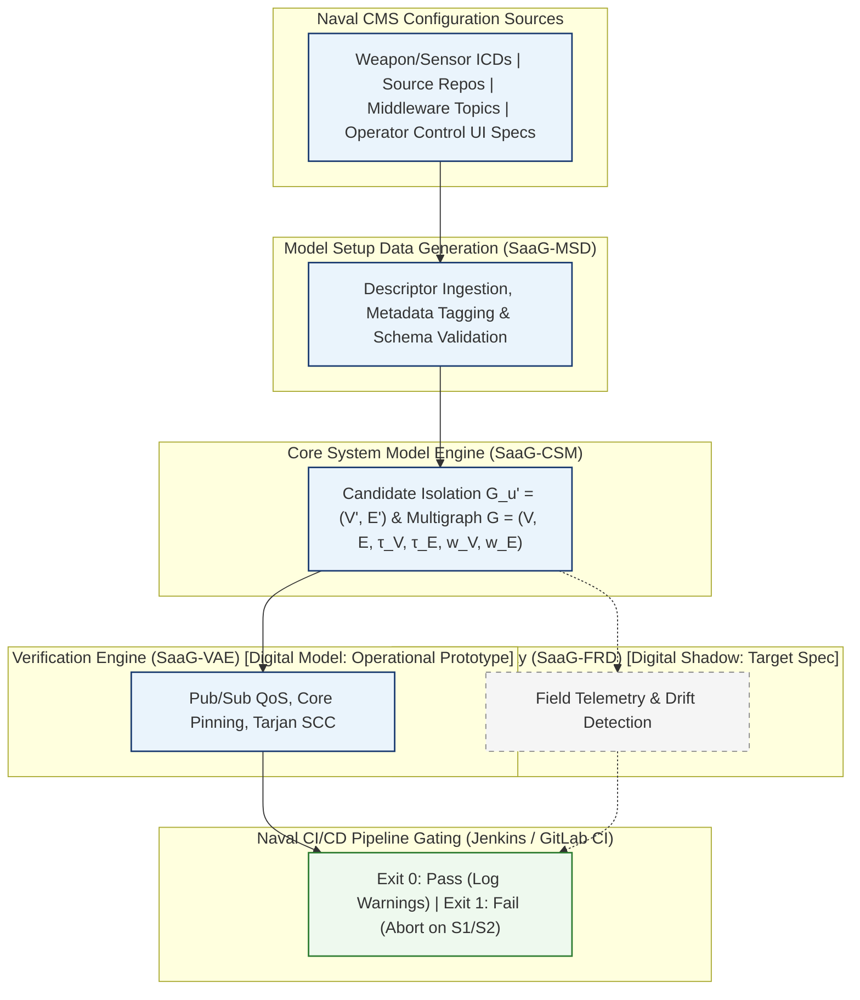

# A Middleware-Centric Architectural Digital Model for Pre-Deployment Verification and CI/CD Gating in Naval Combat Management Systems [Industry Track]

**Conference:** 27th ACM International Middleware Conference (Middleware '26 Industry Track), December 14–18, 2026, Tarragona, Spain

### Authors
- **Ibrahim Onuralp Yigit** — *Command Control and Defense Technologies, HAVELSAN, Istanbul, Turkiye* (`iyigit@havelsan.com.tr`)
- **Onurcan Ersen** — *Command Control and Defense Technologies, HAVELSAN, Istanbul, Turkiye* (`oersen@havelsan.com.tr`)
- **Mustafa Can Caliskan** — *Command Control and Defense Technologies, HAVELSAN, Istanbul, Turkiye* (`mccaliskan@havelsan.com.tr`)
- **Emre Karagoz** — *Software Development Center, TNRCC, Istanbul, Turkiye* (`karagoz.e5926@dzkk.tsk.tr`)
- **Omer Kursat Ucarer** — *Software Development Center, TNRCC, Istanbul, Turkiye* (`ucarer.o1595@dzkk.tsk.tr`)

---

## Abstract

Modern mission-critical Naval Combat Management Systems (CMS) are distributed real-time systems built on publish/subscribe middleware, integrating hundreds of applications across operator consoles, radar trackers, weapon controllers, and tactical data links. Their most severe integration defects are non-local architectural misconfigurations: incompatible Quality-of-Service (QoS) contracts on hard-deadline weapon assignment channels, overlapping CPU core affinity masks, orphaned tactical topics, and circular package dependencies. Such defects survive unit and component testing and surface only during shipyard integration or sea trials.

We report on **System as a Graph (SaaG)**, an architectural digital model for pre-deployment verification and CI/CD gating. Reconstructed from candidate release descriptors rather than runtime synchronization, SaaG builds an attributed, weighted directed multigraph over applications, brokers, topics, infrastructure nodes, and shared libraries; derives asymmetric failure-dependency projections from pub/sub topology; and gates the pipeline on static rule violations ranked by a severity rubric adapted from MIL-STD-882E [1].

Our central industrial finding: graph analysis is not the computational bottleneck. Across five platform profiles generated at operational scale, static verification executes in 15.53\,s on the single-node Maritime Surveillance Aircraft profile and 100.16\,s on the largest, the Corvette Ship profile—under 5.6% of a typical 30-minute CI/CD pipeline. We report the framework architecture, multi-scale verification latency, and practical lessons from building the prototype inside a defense engineering organization.

**Keywords:** Naval Combat Management Systems, Architectural Digital Model, Middleware Verification, QoS, CI/CD Gating, Static Rule Auditing

---

## 1. Introduction & Industrial Problem Statement

Continuous Integration and Continuous Delivery (CI/CD) pipelines have fundamentally transformed software engineering by automating compilation, testing, and artifact generation [14]. In naval defense systems, modern Combat Management Systems (CMS) have evolved from monolithic mainframes into modular, distributed, open-architecture systems governed by high-performance publish/subscribe (pub/sub) middleware [5].

### 1.1 The Pre-Deployment Verification Gap in Naval Combat Systems

Modern naval operations require rapid sensor-to-shooter loops, multi-sensor fusion, coordinated weapon assignment, and cross-platform interoperability. A modern naval combat management system (CMS) developed by **HAVELSAN** with the Turkish Naval Forces Research Center Command (**ARMERKOM**) spans these domains, supporting surface combatants, amphibious platforms, unmanned systems, and airborne maritime assets (Section 4 details the corresponding platform profiles). Across these platforms, the CMS ecosystem comprises hundreds of distributed applications integrated through a proprietary real-time publish/subscribe middleware that adopts the OMG DDS [5] data-centric model and its Request/Offered (RxO) contract semantics for policies including `RELIABILITY`, `DURABILITY`, `PARTITION`, and `DOMAIN_ID`—precisely the policies our verification rules evaluate; DDS terminology is therefore used throughout, and the rules of §3 apply directly to DDS-compatible deployments. Interoperability is further supported via standard tactical data links—Link 11 [15], Link 16 [3], Link 22 [4]—and proprietary operational networking under the **Network Enabled Capability (NEC)** paradigm, where platforms exchange tracks and tactical data for force-level decision making.

*Figure 1: SaaG pipeline integration for a distributed naval combat management system. Dashed paths/boxes are specified for target integration, not yet built.*

When a candidate build is submitted for release, CI/CD pipelines evaluate unit and module tests in isolation, so non-local architectural misconfigurations slip through: latency-critical track fusion daemons are pinned to CPU core masks overlapping non-real-time GUI renderers; endpoints are bound with incompatible Request/Offered (RxO) QoS contracts—a weapon assignment subscriber requesting `TRANSIENT_LOCAL` durability against a fire control publisher offering only `VOLATILE`—so they never match and data never flows, and the incompatible-QoS status is rarely trapped, making the failure effectively silent; refactored TDL forwarding topics are left with zero subscribers; and transitive dependency cycles between weapon allocation planners and threat evaluation modules surface as initialization deadlocks during operator control console start-up.

Provisioning full target hardware testbeds (physical multi-console Combat Information Centers [CIC], real sensor/weapon simulators, and multi-ship test ranges) for every candidate release is prohibitively expensive, logistically complex, and slow. Leaving architectural defects to be discovered during shipyard commissioning, harbor acceptance tests (HAT), or sea acceptance tests (SAT) leads to massive project delays and severe safety risks.

### 1.2 The Architectural Digital Model Paradigm & Dual Operational Usages

To close this gap, we developed **System as a Graph (SaaG)**, which constructs an attributed graph model of the target combat system topology directly from configuration artifacts and interface contracts rather than relying on heavyweight runtime testbeds. Under the digital model/shadow/twin taxonomy of Kritzinger et al. [6], SaaG is strictly an *architectural digital model*—reconstructed deterministically from static artifacts—and serves two complementary operational usages: **Pre-Deployment Verification & CI/CD Gating**, preventing non-conforming builds from reaching integration testbeds; and **Architectural Improvement & Refactoring of Existing Platforms**, exposing circular dependencies, criticality bottlenecks, and dead topics for what-if impact simulation (§2.4).

### 1.3 Key Industrial Contributions & Empirical Findings

This paper makes the following contributions:

1. **Naval CMS Architectural Model Baseline (§2):** A formal directed multigraph representation ($G = (V, E, \tau_V, \tau_E, w_V, w_E)$) capturing 5 entity classes, 6 structural relations, and 6 failure-dependency projection rules that explicitly map the downstream propagation of architectural risk in pub/sub naval combat systems.
2. **CI/CD Pipeline Gating & Verification Methodology (§3, §4):** A two-stage deployment gate—(i) candidate graph construction and (ii) violation audit against the rule catalog—operating on standard CI runners with a defined safety severity rubric (S1–S4) adapted from MIL-STD-882E. We characterize the mission-critical pub/sub misconfiguration classes the rule catalog targets (QoS mismatches, CPU core contention, topic continuity breaks, circular dependencies) and state which are covered by rules implemented in the prototype.
3. **Verification Complexity & Industrial Bottleneck Analysis (§5, §6):** Benchmarks across five industrial-scale naval platform profiles (1,500–3,300 components; 1–65 nodes) show gate latency of 15.53–100.16\,s (P95 $\le 102.31$\,s), under 5.6% of an average 30-minute naval CI/CD pipeline whose duration scales with the number of integrated applications. We document that 6 of 7 specified verification capabilities are blocked by configuration data acquisition across defense engineering silos, not by algorithmic complexity.

---

## 2. The Architectural Digital Model: Formulation and Graph Derivation

SaaG adopts and operationalizes the formal graph modeling foundation established by Yigit and Buzluca [13] for distributed publish-subscribe systems. We formalize the distributed naval CMS middleware topology as an attributed, weighted directed multigraph:

$$G = (V, E, \tau_V, \tau_E, w_V, w_E)$$

### 2.1 Entity Classes and Structural Relations

The vertex set $V$ is partitioned into five distinct entity types ($\tau_V: V \to \mathcal{T}_v$):
- **Applications ($V_{\text{app}}$):** Executable CMS software binaries.
- **Brokers ($V_{\text{broker}}$):** Broker services facilitating CMS communication.
- **Topics ($V_{\text{topic}}$):** Typed publish/subscribe communication channels carrying data payloads.
- **Infrastructure Nodes ($V_{\text{node}}$):** Physical operator control console workstations, ruggedized VME/VPX server chassis, and mission computers.
- **Libraries ($V_{\text{lib}}$):** Shared dynamic libraries.

Six structural edge types ($\tau_E: E_{\text{structural}} \to \mathcal{T}_e$) are extracted directly from configuration descriptors: `PUBLISHES_TO`, `SUBSCRIBES_TO`, `ROUTES`, `RUNS_ON`, `CONNECTS_TO`, and `USES`. We additionally write `COLOCATED_WITH` for the symmetric relation *induced* by two units sharing a `RUNS_ON` target; it is derived rather than ingested, and is used in Table 1.

### 2.2 Asymmetric Failure-Dependency Projection

In pub/sub middleware, messages flow from publisher to subscriber ($A \to B$), but **structural failure dependency points in the exact opposite direction ($B \xrightarrow{\text{DEPENDS\_ON}} A$)**: if Publisher $A$ (e.g., radar tracker) fails or produces corrupt messages, Subscriber $B$ (e.g., fire control calculator) is starved; conversely, a crashed $B$ leaves $A$ unaffected. Building upon Yigit and Buzluca [13], SaaG projects logical `DEPENDS_ON` edges from structural topology (Table 1).

*Table 1: Derived Logical Dependency Edge Projection Rules.*

| Rule | Type | Derivation Pattern | Weight $w(e)$ |
|:---:|:---|:---|:---:|
| 1 | `app_to_app` | Unit $B$ subscribes to topic $t$; unit $A$ publishes to $t$ | $\max_{t} w(t)$ |
| 2 | `app_to_broker` | Unit $A$ publishes/subscribes to $t$; broker $R$ routes $t$ | $\max_{t} w(t)$ |
| 3 | `node_to_node` | Lifted from Rule 1: hosted units on nodes $n_B$ and $n_A$ | $\max_{e} w(e)$ |
| 4 | `node_to_broker` | Lifted from Rule 2: hosted unit on node $n$ and broker $R$ | $\max_{e} w(e)$ |
| 5 | `app_to_lib` | Unit $A$ links against library $\ell$ (`USES`) | $w(A)$ |
| 6 | `broker_to_broker` | Two brokers share one physical node (`COLOCATED_WITH`) | $w(n)$ |

### 2.3 Intrinsic QoS & Criticality Weight Propagation

SaaG assigns each entity $v$ a criticality weight $w(v) \in [0,1]$ from an expert-elicited linear weighting of QoS contracts, normalized message size, and topology fan-out. The topic weight combines a QoS score with a normalized message size:

$$w(t) = \max\Big(0.01,\; \beta \cdot \text{QoS\_score}(t) + (1-\beta) \cdot \text{size\_norm}(t)\Big) \tag{1}$$

where:
$$\text{QoS\_score}(t) = 0.30 \cdot \text{rel} + 0.40 \cdot \text{dur} + 0.30 \cdot \text{prio}$$
$$\text{size\_norm}(t) = \min\left(\frac{\log_2(1 + \text{size\_kb})}{50},\; 1\right)$$
and $\beta = 0.85$. Weights then propagate upward across entity types as shown in Table 2.

*Table 2: Per-entity criticality weight rules.*

| Entity | Weight Rule |
|:---|:---|
| **Topic $t$** | Equation (1) |
| **App $a$ / Broker $b$** | $\alpha \max_{t \in T} w(t) + (1-\alpha) \text{mean}_{t \in T} w(t)$; with $\alpha_a = 0.80$, $\alpha_b = 0.70$ |
| **Library $\ell$** | $\min\Big(1,\; w_0 (1 + \gamma \log_2(1 + \text{deg}_{\text{in}}(\ell)))\Big)$; with $w_0 = 0.20$, $\gamma = 0.15$ |
| **Node $n$** | $\max_{v:\, v\ \text{RUNS\_ON}\ n} w(v)$ |

*QoS factor values:*
- **Reliability:** `RELIABLE` = 1.0, `BEST_EFFORT` = 0.0
- **Durability:** `PERSISTENT` = 1.0, `TRANSIENT_LOCAL` = 0.5, `VOLATILE` = 0.0
- **Priority:** `CRITICAL` = 1.0, `HIGH` = 0.66, `LOW` = 0.0

### 2.4 Operational Usages: Pipeline Gating and Platform Refactoring

The architectural digital model serves two complementary functions across the naval combat system lifecycle:

1. **Pre-Deployment Verification & Pipeline Gating (Forward Mode):** During CI/CD builds, SaaG instantiates an isolated candidate graph $G_{u'} = (V', E')$ by substituting candidate unit version $u'$ into the baseline platform inventory, guaranteeing baseline immutability, and audits $G_{u'}$ against the static middleware rules of §3 in $\le 100.2$\,s, enforcing fail-closed gating on S1/S2 violations.
2. **Architectural Improvement & Platform Refactoring (Diagnostic Mode):** Architects query the global baseline model $G_{\text{baseline}}$ to drive systemic refactoring: Tarjan's SCC extracts cyclic subgraphs (e.g., WASA allocation against threat evaluation) for decoupling; topology fan-out with $w(v)$ pinpoints overloaded brokers and high-fanout topics; orphaned topics and unreferenced libraries expose accumulated configuration debt; and proposed structural changes can be simulated before production source is touched.

---

## 3. Model-Driven Verification Rules & CI/CD Pipeline Gating

SaaG enforces static compliance rules over $G_{u'}$. Table 3 separates rules implemented in the prototype (SaaG-P, $\bullet$), which are audited statically on descriptors today, from those specified for the target enterprise integration but not yet realized ($\circ$).

*Table 3: Verification Rules Catalog. SaaG-P: implemented in the operational prototype (audited on descriptors today); SaaG-D: specified for the target digital-shadow integration ($\bullet$ implemented; $\circ$ specified only).*

| Policy / Rule | SaaG-P | SaaG-D | Target Middleware Check |
|:---|:---:|:---:|:---|
| Pub/Sub RxO QoS Matching | $\bullet$ | $\bullet$ | Durability & Reliability ($O \ge R$) |
| CPU Core Allocation | $\bullet$ | $\bullet$ | Core count $\le C(v_p)$ per host |
| CPU Core Non-Overlap | $\circ$ | $\bullet$ | Pairwise non-overlapping masks |
| Topic Continuity | $\bullet$ | $\bullet$ | Orphaned topics ($|P|=0 \lor |S|=0$) |
| Tactical Schema Match | $\bullet$ | $\bullet$ | TDL / Link 16 / STANAG match |
| Circular Dependencies | $\bullet$ | $\bullet$ | Tarjan's SCC on dependencies |
| Telemetry Drift | $\circ$ | $\bullet$ | $E_{\text{Observed}} \setminus E_{\text{Designed}}$ via logs |

### 3.1 Severity Rubric & Alignment with Military Safety Standards (MIL-STD-882E)

MIL-STD-882E classifies the severity of *mishap consequences*, not of static configuration defects, so we *adapt* rather than adopt its four-level scale: each violation is assigned the severity of the worst credible mishap it could contribute to, given the criticality of the channels and hosts it affects. Severity is deliberately decoupled from transport priority, since a `LOW`-priority channel may still gate a safety-critical function:
- **S1 (Critical — Catastrophic / Safety Critical):** Complete loss of safety-critical functions (e.g., RxO mismatch on weapon assignment channels, CPU over-allocation on fire control servers).
- **S2 (High — Critical / Mission Essential):** Severe defects with localized redundancy or secondary mitigation (e.g., orphaned tactical data link topics, circular dependencies among WASA engagement planning units).
- **S3 (Medium — Marginal / Operational):** Non-critical configuration anomalies (e.g., best-effort auxiliary sensor stream topic leaks).
- **S4 (Low / Informational):** Style and maintenance warnings (e.g., deprecated utility library versions, non-standard topic naming).

### 3.2 CI/CD Runner Integration: Exit Codes, Delta-Aware Gating, & Waiver Register

SaaG integrates into standard Jenkins and GitLab CI/CD runners via a CLI gate:

*Table 4: CLI gate exit codes and gate effect.*

| Exit Code | Meaning / Gate Effect |
|:---:|:---|
| **0** | **PASS** — no S1/S2 violations (S3/S4 logged as warnings) |
| **1** | **FAIL** — S1 or S2 detected; pipeline aborted |
| **2** | **ERROR** — execution / parse failure |

Standard CI runners treat non-zero exit codes as build failures. On safety-critical release branches (weapon control, fire authorization, track fusion) SaaG runs **fail-closed**: an Exit-2 tool error aborts the pipeline, so a candidate that cannot be analyzed is never allowed through unverified; non-tactical auxiliary branches may run fail-open, logging Exit 2 as a warning with mandatory audit capture. In legacy codebases carrying pre-existing technical debt, an absolute gate would block every build, so SaaG supports *delta-aware gating*: a candidate is blocked only if $\text{Violations}(G_{u'}) \setminus \text{Violations}(G_{\text{baseline}}) \neq \emptyset$, with known legacy violations managed via a Chief Architect-approved *Waiver Register* carrying cryptographic signatures and expiration dates.

---

## 4. Multi-Scale Platform Architectures & Verification Methodology

To assess the practical applicability of SaaG pre-deployment verification in an operational defense-system environment, we model the architectural scales and middleware configurations of five representative platform profiles spanning airborne, coastal surveillance, unmanned, surface-combatant, and task-group command domains.

### 4.1 Multi-Domain Combat System Architecture & Platform Profiles

To capture this diversity, we construct five representative platform profiles:
- **Maritime Surveillance Aircraft:** Represents maritime patrol aircraft, helicopters, and airborne unmanned platforms integrating radar processing, acoustic sensing, and tactical data-link relay within a compact single-node deployment ($|V| \approx 1{,}500$, $|E| \approx 4{,}800$, 1 node).
- **Coastal Surveillance:** Represents multi-sensor maritime picture compilation centers integrating radar, AIS, ADS-B, and electro-optical surveillance across 25 server nodes ($|V| \approx 2{,}200$, $|E| \approx 7{,}100$).
- **Unmanned Sea Surface Vehicle:** Represents mission-management architectures for unmanned surface, underwater, and aerial vehicles, with interoperability aligned to STANAG 4586 [2] ($|V| \approx 2{,}200$, $|E| \approx 7{,}000$, 1 node).
- **Amphibious Ship:** Represents task-group and joint-operations command environments spanning 65 consoles and server chassis ($|V| \approx 2{,}800$, $|E| \approx 9{,}600$).
- **Corvette Ship:** Represents multi-warfare combat management supporting anti-air, anti-surface, anti-submarine, and electronic warfare functions across distributed operator consoles ($|V| \approx 3{,}300$, $|E| \approx 11{,}500$, 20 nodes).

Profile sizes span $|V|$ from 1,500 to 3,300 and $|E|$ from 4,800 to 11,500 (Table 6). Across all platform scales, subsystems rely on a DDS-based publish/subscribe middleware to facilitate real-time sensor-to-shooter coordination and Network Enabled Capability (NEC).

### 4.2 Continuous Verification & Pipeline Gating Workflow

On every merge request, SaaG runs inside the CI runner in four stages:
1. Extracts candidate unit descriptors, IDL schemas, topic bindings, and node affinity masks and builds the isolated candidate multigraph $G_{u'}$;
2. Projects inverted failure edges ($B \xrightarrow{\text{DEPENDS\_ON}} A$) and hierarchical criticality weights;
3. Evaluates the rule catalog over QoS contracts, core pinning bounds, topic connectivity, and SCC cycles;
4. Checks new violations against the baseline register and waiver list, returning Exit 0 or Exit 1.

### 4.3 Evaluation on Representative Architectural Misconfiguration Scenarios

Operational defect records for fielded combat systems are not releasable. We therefore characterize the verification engine by the *classes* of architectural misconfiguration its rule catalog targets, drawn from naval integration experience: these are illustrative fault classes, not measured detection results, and we report no true- or false-positive rates (establishing them requires the configuration data §6 shows we cannot yet obtain). Five representative scenarios span the catalog:
- **Scenario A (S1):** A weapon assignment channel whose offered durability is lowered to `VOLATILE` against a subscriber requesting `TRANSIENT_LOCAL`, silently dropping weapon orders.
- **Scenario B (S1):** Overlapping CPU core affinity masks between track fusion and 3D tactical display servers, causing latency jitter beyond hard 25\,ms deadlines (the prototype checks only aggregate core capacity per host; pairwise mask non-overlap is specified but not implemented, per §6).
- **Scenario C (S2):** Refactored Link 16 forwarding topics left without subscribers ($|S(t)|=0$).
- **Scenario D (S2):** Transitive dependency cycles between weapon allocation planners and threat evaluators, inducing initialization deadlocks during operator control console start-up.
- **Scenario E (S1):** A primary and redundant sensor gateway configured into different middleware `PARTITION`s, so the redundant path never matches its subscribers—graded S1 because the silent loss of the intended failover degrades a safety-critical redundancy requirement.

*Table 5: Representative naval middleware misconfiguration classes targeted by the rule catalog ($\bullet$ rule implemented in prototype; $\circ$ specified only).*

| Scen. | Architectural Fault | Sev. | Targeting Rule | Status |
|:---|:---|:---:|:---|:---:|
| **A** | Pub `VOLATILE` vs Sub `TRANSIENT_LOCAL` | S1 | Pub/Sub RxO Match | $\bullet$ |
| **B** | CPU core mask overlap (cores 2–3) | S1 | Core Pinning Non-Overlap | $\circ$ |
| **C** | Orphaned Link 16 forwarding topic | S2 | Topic Continuity | $\bullet$ |
| **D** | Cyclic dependency (WASA vs threat-eval) | S2 | Tarjan SCC | $\bullet$ |
| **E** | `PARTITION` mismatch on sensor gateway | S1 | Pub/Sub RxO Match (`PARTITION`) | $\bullet$ |

---

## 5. Computational Performance & Scalability

### 5.1 Multi-Scale Naval Platform Benchmarking Setup

**Profile provenance:** The scale parameters—application, topic, node, and library counts, with the QoS and fan-out distributions—were elicited from architects of corresponding operational combat-system deployments; the topologies themselves are generated, not exported from fielded systems (release restriction, §6), reproducing the size and structural characteristics of real deployments without operational configuration data. They span 180–320 applications, 1,200–2,800 topics, 40–110 libraries, and 1–65 nodes, yielding $|V|$ from 1,500 (Maritime Surveillance Aircraft) to 3,300 (Corvette Ship) and $|E|$ from 4,800 to 11,500. Absolute latencies are therefore representative of this deployment scale rather than measurements of any specific platform.

**Environment:** Ubuntu 22.04 LTS (AMD EPYC 7763, 32 GB RAM), Python 3.11 with NetworkX 3.2, in-memory graph construction without external database roundtrips. Each reported value is the mean of 500 candidate build evaluations per profile across 5 generator seeds, after 20 warm-up runs.

*Table 6: Gate Execution Latency Across Five Representative Platform Profiles ($N=500$; node, component, and edge counts are approximate).*

| Profile | Nodes | Comp. ($|V|$) | Edges ($|E|$) | Construct. (s) | Anal. (s) | Total (s) | P95 (s) |
|:---|:---:|:---:|:---:|:---:|:---:|:---:|:---:|
| **Maritime Surveillance Aircraft** | 1 | 1,500 | 4,800 | 11.110 | 4.416 | **15.526** | 17.270 |
| **Coastal Surveillance** | 25 | 2,200 | 7,100 | 24.493 | 14.071 | **38.565** | 38.935 |
| **Unmanned Sea Surface Vehicle** | 1 | 2,200 | 7,000 | 23.525 | 21.898 | **45.423** | 47.625 |
| **Amphibious Ship** | 65 | 2,800 | 9,600 | 44.521 | 41.345 | **85.866** | 87.677 |
| **Corvette Ship** | 20 | 3,300 | 11,500 | 52.344 | 47.813 | **100.157** | 102.312 |

*Table 7: Specified vs. Implemented Gap Analysis in SaaG Verification Capability for Naval Combat Systems.*

| # | Specified Verification Capability | Realized in Prototype | Primary Operational Blocker |
|:---:|:---|:---|:---|
| 1 | Endpoint-level pub/sub RxO conformance | Topic-level only | **Data:** endpoint IDL descriptors held in vendor-siloed toolchains |
| 2 | Field-level payload schema alignment | Topic-name match | **Data:** third-party sensor/weapon ICD parsers not on the build runner |
| 3 | Hardware core pinning non-overlap | Host capacity only | **Data:** OS core-binding scripts outside application source repos |
| 4 | OS memory & kernel parameter audit | Requirement only | **Data:** target host profiles unavailable via programmatic CMDB |
| 5 | Live architectural drift telemetry | Diff engine spec | **Data:** operational field-log telemetry repository unbuilt |
| 6 | Scored installation suitability model | Exit-code gate | **Impl.:** penalty weights need cross-organization calibration |
| 7 | Automated CMDB & topology ingestion | JSON descriptors | **Data:** enterprise CMDB lacks machine-readable REST export |

### 5.2 Scaling Dynamics & Computational Performance Breakdown

The benchmark results in Table 6 demonstrate two central insights:

- **Dominance of Graph Construction:** Graph construction accounts for **51.8% to 71.6% of total wall-clock time** across all platform profiles (e.g., 11.11\,s out of 15.53\,s for Maritime Surveillance Aircraft, and 52.34\,s out of 100.16\,s for Corvette Ship), while pure graph analysis and rule evaluation account for the remaining **28.4% to 48.2%** (4.42\,s to 47.81\,s).
- **Predictable Latency Scaling with Topological Complexity:** Verification latency scales monotonically with overall component count and dependency graph density, ranging from **15.53\,s** for the compact Maritime Surveillance Aircraft profile up to **100.16\,s** for the Corvette Ship deployment. Distributed multi-node configurations such as the 65-node Amphibious Ship (85.87\,s) incur substantial dependency projection and cross-node lifting overhead, yet overall verification latency remains well within practical CI/CD runtime tolerances ($<1.7$\,minutes).

While the gate's internal cost is dominated by graph *construction*, the entire gate (construction plus analysis) stays within $\le 100.2$\,s and is therefore negligible against the full pipeline. In our operational naval software engineering environments, complete CI/CD pipeline execution averages approximately 30 minutes (measured on the program's release pipeline), scaling with the number of integrated applications (compilation, unit tests, and container packaging across 180–320 binaries). Across all operational configurations, total pipeline gating latency remains $\le 100.2$\,s (P95 $\le 102.3$\,s, $\le 5.6\%$ of overall pipeline time), confirming that static architectural verification is practical for pre-deployment gating without introducing prohibitive delays.

---

## 6. Industrial Lessons: The Data-Acquisition Bottleneck in Architectural Digital Modeling

The primary practical insight from building SaaG inside a naval defense engineering organization is that **the computational cost of graph analysis is negligible, but configuration data acquisition across enterprise and security silos is the true blocker.**

**Deployment status:** SaaG runs today as a prototype CLI gate on a GitLab CI runner, consuming hand-curated JSON descriptors exported from application repositories, and enforcing the rules marked $\bullet$ in Table 3. It is not yet wired to an authoritative configuration source; consequently we report no violation counts, true- or false-positive rates, or defects caught on a fielded baseline. The evaluation in §5 measures gate latency; §6 contributes the gap analysis explaining why the remaining capabilities are blocked.

### 6.1 The Anatomy of Configuration Data Silos in Defense Projects

Table 7 shows 6 of the 7 specified capabilities blocked by configuration data silos, of three kinds:
1. Application code lives in Git, while sensor and weapon Interface Control Documents and hardware core pinnings live in isolated shipyard commissioning archives under separate release control;
2. QoS contracts are fragmented across XML profiles, C++ pragmas, and startup scripts, with no single authoritative form;
3. Enterprise asset databases are structured for manual inventory audit rather than programmatic query, so a CI runner cannot ask them what a target host looks like.

*Recommendation:* Organizations introducing architectural digital models into naval combat systems should invest first in declarative, centralized configuration-as-code and machine-readable ICD registries, and only then in graph reasoning engines. The reasoning was never the hard part.

### 6.2 Limitations

Three limitations bound these results:
1. Effectiveness is characterized by the fault classes the catalog targets (Table 5), not by measured detection rates on operational baselines; the data needed to establish those rates is exactly what §6 reports as blocked.
2. The criticality weights of §2.3 are expert-elicited and uncalibrated, and we have not run a sensitivity analysis; they order components plausibly for triage but should not be read as validated risk scores. `QoS_score` also omits `DEADLINE`, `LATENCY_BUDGET`, and `LIVELINESS`, which matter for the hard-deadline channels we motivate.
3. Latency is measured on generated topologies at realistic scale (§5.1), so it characterizes a scale class rather than a specific ship.

---

## 7. Related Work

**Architecture conformance and configuration errors:** Murphy et al. [7] pioneered Software Reflexion Models comparing designs against extracted call graphs; Perry and Wolf [8] and de Silva and Balasubramaniam [9] characterized architectural erosion; Terra and Valente [10] introduced dependency constraint languages; and Yigit and Buzluca [13] formulated graph-based dependency analysis for critical components in pub/sub systems. On the configuration side, Xu and Zhou [11] surveyed configuration error detection, Tang et al. [12] described holistic configuration management at Facebook, and Huang et al. [14] validated cloud configurations declaratively with ConfValley. SaaG carries this line into safety-critical naval pub/sub systems, coupling RxO contract matching to a military severity rubric.

**Policy-as-code, middleware diagnostics, and digital twins:** Policy engines such as ArchUnit and OPA-Gatekeeper enforce static rules over code and manifests, while DDS and ROS 2 tooling reports QoS incompatibility at runtime [5]—but only once endpoints have initialized in the target environment, which for a combat system means a testbed or a ship; SaaG moves the same class of check left, into the pipeline. Kritzinger et al. [6] established the digital model/shadow/twin taxonomy and Tao et al. [15] reviewed industrial digital twins; we adapt the digital *model* to software architecture as a static, reproducible gating baseline.

---

## 8. Conclusion

We presented **SaaG**, an architectural digital model for pre-deployment verification and CI/CD gating in mission-critical Naval Combat Management Systems. It audits candidate releases against pub/sub QoS contracts, core allocations, topic continuity, and dependency cycles inside the pipeline, and gives architects global analytics for diagnosing structural debt in fielded platforms. Across five representative platform profiles spanning the single-node Maritime Surveillance Aircraft profile to the 65-node Amphibious Ship and the full-scale Corvette Ship, gating costs $\le 100.2$\,s—under 5.6% of a typical 30-minute build pipeline. The constraint is configuration data acquisition across defense engineering silos, which still blocks 6 of the 7 capabilities our architects specified. Our next step is therefore ingestion rather than analysis: automated ICD harvesters, delta-aware gating across multi-platform pipelines, and—once field telemetry exists—the one-way runtime feed that would make this digital model a digital shadow.

---

## Acknowledgments

Generative AI tools were used in this work solely for grammar and language polishing. The authors retain full responsibility for all technical content, claims, data, and results presented in this paper.

---

## References

1. **Department of Defense**, "System Safety (MIL-STD-882E)," U.S. Department of Defense, DoD Standard Practice, 2012.
2. **NATO Standardization Office**, "STANAG 4586: Standard Interfaces of UAV Control System (UCS) for NATO UAV Interoperability," Edition 4, 2017.
3. **NATO Standardization Office**, "STANAG 5516: Tactical Data Exchange — Link 16," Edition 8, 2020.
4. **NATO Standardization Office**, "STANAG 5522: Tactical Data Exchange — Link 22," Edition 3, 2021.
5. **Object Management Group (OMG)**, "Data Distribution Service (DDS) Specification," Version 1.4, 2015.
6. **W. Kritzinger et al.**, "Digital Twin in Manufacturing: A Categorical Literature Review," *IFAC-PapersOnLine*, vol. 51, no. 11, pp. 1016–1022, 2018.
7. **G. C. Murphy, D. Notkin, and K. J. Sullivan**, "Software Reflexion Models," *IEEE Transactions on Software Engineering*, vol. 27, no. 4, pp. 364–380, 2001.
8. **D. E. Perry and A. L. Wolf**, "Foundations for the Study of Software Architecture," *ACM SIGSOFT Software Engineering Notes*, vol. 17, no. 4, pp. 40–52, 1992.
9. **L. de Silva and D. Balasubramaniam**, "Controlling Software Architecture Erosion," *Journal of Systems and Software*, vol. 85, no. 1, pp. 132–151, 2012.
10. **R. Terra and M. T. Valente**, "A Dependency Constraint Language," *Software: Practice and Experience*, vol. 44, no. 9, pp. 1073–1094, 2014.
11. **T. Xu and Y. Zhou**, "Systems Approaches to Tackling Configuration Errors," *ACM Computing Surveys*, vol. 47, no. 4, p. 70, 2015.
12. **C. Tang et al.**, "Holistic Configuration Management at Facebook," in *Proceedings of ACM SOSP*, pp. 328–343, 2015.
13. **I. O. Yigit and F. Buzluca**, "A Graph-Based Dependency Analysis Method for Identifying Critical Components in Distributed Publish-Subscribe Systems," in *IEEE International Conference on Recent Advances in Systems Science and Engineering (RASSE)*, 2025, doi: 10.1109/RASSE64831.2025.11315354.
14. **P. Huang et al.**, "ConfValley: Validating System Configurations," in *Proceedings of ACM EuroSys*, Article 4, 2015.
15. **J. Humble and D. Farley**, *Continuous Delivery*, Addison-Wesley, 2010.
16. **F. Tao et al.**, "Digital Twin in Industry: State-of-the-Art," *IEEE Transactions on Industrial Informatics*, vol. 15, no. 4, pp. 2405–2415, 2019.
17. **NATO Standardization Office**, "STANAG 5511: Tactical Data Exchange — Link 11," Edition 3, 2019.
